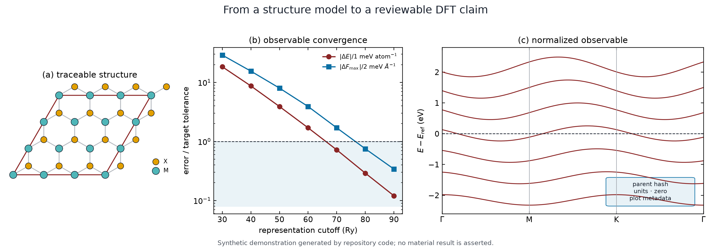
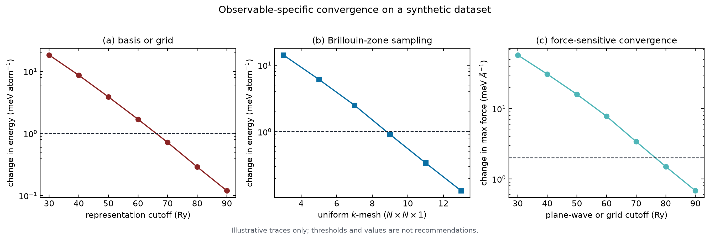
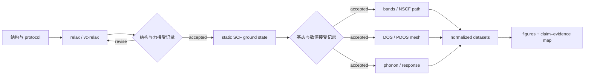
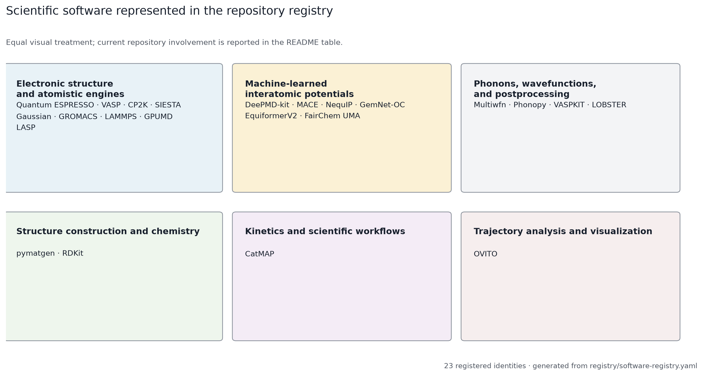
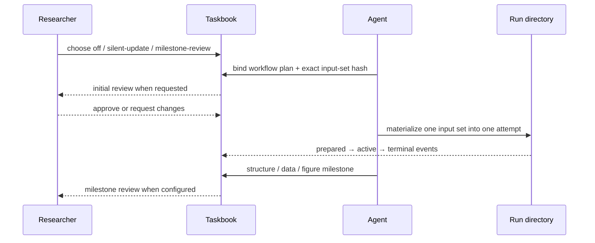

# Vibe-DFT-Skills

> **鸣谢 / Acknowledgements**
>
> 本仓库的计算规范、结构处理、数据分析、官方资料路由和发展路线建立在广泛的
> 科学软件与 Python 工具之上。下面的清单按实际关系区分 active calculation
> routes、development targets、直接依赖、文档工具和方法参考。
>
> <details>
> <summary>展开完整软件与软件包清单</summary>
>
> **Scientific software represented in the registry**
>
> - Active calculation routes:
>   [Quantum ESPRESSO](https://www.quantum-espresso.org/) (`qe`)、
>   [VASP](https://vasp.at/) (`vasp`)、
>   [CP2K](https://www.cp2k.org/) (`cp2k`)、
>   [SIESTA](https://siesta-project.org/siesta/) (`siesta`)。
> - Development and planned calculation software:
>   [Gaussian](https://gaussian.com/) (`gaussian`)、
>   [GROMACS](https://www.gromacs.org/) (`gromacs`)、
>   [LAMMPS](https://www.lammps.org/) (`lammps`)、
>   [GPUMD](https://gpumd.org/) (`gpumd`)、
>   [LASP](http://www.lasphub.com/) (`lasp`)。
> - Machine-learned interatomic potentials:
>   [DeePMD-kit](https://docs.deepmodeling.com/projects/deepmd/en/stable/)
>   (`deepmd`)、
>   [MACE](https://mace-docs.readthedocs.io/en/latest/) (`mace`)、
>   [NequIP](https://www.nequip.net/) (`nequip`)、
>   [GemNet-OC](https://fair-chem.github.io/models-1/) (`gemnet-oc`)、
>   [EquiformerV2](https://fair-chem.github.io/models-1/) (`equiformer-v2`)、
>   [FairChem UMA](https://fair-chem.github.io/uma/) (`fairchem-uma`)。
> - Analysis, postprocessing, kinetics, and visualization:
>   [Multiwfn](http://sobereva.com/multiwfn/) (`multiwfn`)、
>   [Phonopy](https://phonopy.github.io/phonopy/) (`phonopy`)、
>   [VASPKIT](https://vaspkit.com/) (`vaspkit`)、
>   [CatMAP](https://catmap.readthedocs.io/en/latest/) (`catmap`)、
>   [LOBSTER](https://schmeling.ac.rwth-aachen.de/cohp/)
>   (`lobster`)、
>   [OVITO](https://www.ovito.org/) (`ovito`)。
> - Structure and chemistry libraries:
>   [pymatgen](https://pymatgen.org/) (`pymatgen`)、
>   [RDKit](https://www.rdkit.org/) (`rdkit`)。
>
> **Direct implementation dependencies**
>
> [ASE](https://ase-lib.org/) (`ase`)、
> [Gemmi](https://gemmi.readthedocs.io/en/stable/) (`gemmi`)、
> [PyCifRW](https://github.com/jamesrhester/pycifrw) (`PyCifRW`)、
> [spglib](https://spglib.readthedocs.io/en/stable/) (`spglib`)、
> [NumPy](https://numpy.org/) (`numpy`)、
> [Matplotlib](https://matplotlib.org/) (`matplotlib`)、
> [jsonschema](https://python-jsonschema.readthedocs.io/) (`jsonschema`)、
> [PyYAML](https://pyyaml.org/) (`PyYAML`)、
> [Beautiful Soup](https://www.crummy.com/software/BeautifulSoup/)
> (`beautifulsoup4`)、
> [certifi](https://github.com/certifi/python-certifi) (`certifi`)、
> [lxml](https://lxml.de/) (`lxml`)。
>
> **Documentation tooling**
>
> Official HTML pages are converted to local Markdown with
> [`helloworld-Co/html2md`](https://github.com/helloworld-Co/html2md).
>
> **Workflow and methods references**
>
> The repository information architecture also draws on published practice from
> [AiiDA](https://github.com/aiidateam/aiida-core),
> [AiiDA common workflows](https://github.com/aiidateam/aiida-common-workflows),
> [atomate2](https://github.com/materialsproject/atomate2),
> [quacc](https://github.com/Quantum-Accelerators/quacc), and
> [pyiron](https://github.com/pyiron/pyiron_atomistics).
>
> </details>

<p align="center">
  
</p>

一张能带图的可信度由前序计算共同决定。结构来源、赝势或基组、交换关联近似、
截断参数、Brillouin-zone sampling、SCF 状态和 parent calculation 都需要留下
可复查记录。图中的能量零点、单位、路径和投影选择还需要绑定到生成它的数据。

Vibe-DFT-Skills 为这些工作提供 Agent 可读取的计算规范、version-matched
官方资料、确定性输入/输出检查、收敛记录、运行谱系和交接格式。研究者保留
科学问题、路线选择与结果接受权；计算软件和集群继续负责数值执行。

仓库当前包含 26 个 source-backed Skills。7 个 active Skills 覆盖 CIF
结构分析、Quantum ESPRESSO、VASP、CP2K、SIESTA、DFT 后处理和 campaign
efficiency；19 个 development Skills 保存正在建设的计算、模拟、分析与
科研协作路线。

最后更新：2026-07-28（Asia/Shanghai）

## 一个合成示例：从层状结构到电子结构证据

下面的 `MX₂` 层状模型和全部曲线由
[`docs/showcase/generate_showcase.py`](docs/showcase/generate_showcase.py)
生成。数据用于演示仓库工具和信息结构，不对应真实材料，也不提供参数推荐。

1. **读取结构。** CIF parser 保留 data block、原始标签、occupancy、
   standard uncertainty 和源文件 hash。物化后的周期结构接受短距离、周期近邻、
   对称性和结构 identity 检查。
2. **定义 observable。** 研究目标先写成可计算量，例如晶格常数、相对能量、
   band gap、projected DOS、phonon frequency 或 migration barrier。
3. **选择数值模型。** 软件版本、XC functional、pseudopotential/basis、
   magnetism、SOC、dispersion、boundary condition 和 charge state 进入
   protocol identity。
4. **建立收敛分支。** 表示精度、k/q mesh、SCF、empty states、supercell
   和任务专属参数逐项变化；参考分支保持其他变量固定。
5. **保存 parent lineage。** relaxation、static ground state、NSCF、
   bands、DOS 和 phonon 之间使用 hash-bound parent records 连接。
6. **整理数据与图件。** 能量零点、单位、归一化、selector、parent hash 和
   plotting metadata 随图件一起保存。

<table>
  <tr>
    <td width="47%" align="center">
      <br>
      <sub>表示精度、采样与力的独立收敛检查；数值仅用于演示。</sub>
    </td>
    <td width="53%" align="center">
      <br>
      <sub>由 normalized synthetic tables 生成的 bands–TDOS/PDOS 图。</sub>
    </td>
  </tr>
</table>

## DFT 计算中需要收敛的量

数值误差需要与目标 observable 对照。总能稳定可以满足某些结构排序，却仍可能
留下明显的力、应力、声子或能带误差。每个 convergence record 因此绑定被改变
的参数、固定条件、原始 artifact、提取器、单位、比较规则和接受阈值。

| 证据维度 | 常见控制量 | 观察量 |
|---|---|---|
| 表示精度 | plane-wave cutoff、real-space mesh、Gaussian/NAO basis、FFT/grid settings | 总能、相对能、力、应力、charge density |
| Brillouin-zone sampling | k mesh、q mesh、offset、symmetry reduction、high-symmetry path | 金属占据、DOS、band extrema、phonon dispersion、EPC |
| 电子求解 | SCF threshold、mixing、smearing、diagonalization、empty states | density residual、能量、磁矩、occupation、response stability |
| 离子与晶胞 | force/stress threshold、optimizer、constraints、cell degrees of freedom | 最大力、应力、结构分支、体积与晶格形状 |
| 有限尺寸 | supercell、vacuum、dipole/electrostatic treatment、defect separation | formation energy、interaction error、surface/defect observables |
| 任务专属 | displacement、NEB images、time step、trajectory length、frequency grid、broadening | phonon、barrier、drift、sampling error、spectrum/response |

跨代码比较还需要固定物理模型和比较协议。Lejaeghere 等人的
[solid-state DFT reproducibility study](https://doi.org/10.1126/science.aad3000)
系统比较了不同实现的 equation of state；SSSP 的
[pseudopotential protocol](https://doi.org/10.1038/s41524-018-0127-2)
同时考察 equation of state、pressure、cohesive energy、phonon 和 band
structure。仓库沿用这种 observable-specific 记录方式，不把单一参数测试扩展
成所有性质的统一结论。

## 计算谱系

一个典型固体电子结构任务包含多个父子计算。下图中的每条边都对应结构、
方法、输入和 checkpoint identity；接受记录决定下游是否可以引用该 parent。



## 科学软件版图

下列软件全部来自
[`registry/software-registry.yaml`](registry/software-registry.yaml)。各组采用
同一套字段；“当前涉及范围”是唯一的软件状态与仓库覆盖说明栏。

<p align="center">
  
</p>

### 电子结构、量子化学与原子模拟引擎

| 软件 | 数值方法或科学角色 | 代表性任务 | 当前涉及范围 |
|---|---|---|---|
| `qe` · [Quantum ESPRESSO](https://www.quantum-espresso.org/) | Plane-wave basis；norm-conserving、ultrasoft 与 PAW pseudopotentials；DFPT | `pw.x` ground state/relax/MD，`ph.x` phonon/EPC，`neb.x` reaction paths，bands/DOS 与多种 response executables | `qe-rigorous-calculations` 为 active。解析官方输入项并审计 `pw.x`；SCF、relax、vc-relax 有自动 output gates，其他任务使用 task-specific evidence plans。 |
| `vasp` · [VASP](https://vasp.at/) | Plane-wave PAW electronic structure | relax/static、bands/DOS、phonon、NEB、defect/surface、magnetism、SOC、DFT+U、hybrid、GW、optics | `vasp-rigorous-calculations` 为 active。审计 INCAR、POSCAR、KPOINTS、POTCAR metadata、OUTCAR 与 `vasprun.xml`，并按 task profile 检查 convergence 和 parent lineage。 |
| `cp2k` · [CP2K](https://www.cp2k.org/) | Quickstep GPW/GAPW；Gaussian orbitals 与 density grids；多理论层级 | ENERGY、GEO_OPT/CELL_OPT、AIMD、bands/DOS、vibrations、NEB、hybrid/ADMM、DFT+U、QM/MM 与 sampling | `cp2k-rigorous-calculations` 为 active。绑定 2026.2 manual、basis/potential provenance、SCF/grid/k-point evidence、输入输出 gates 和 task/method profiles。 |
| `siesta` · [SIESTA](https://siesta-project.org/siesta/) | Numerical atomic orbitals、pseudopotentials 与 real-space mesh | SCF、fixed/variable-cell relaxation、MD、bands/DOS、phonon、optics、RT-TDDFT、TranSIESTA/TBtrans | `siesta-rigorous-calculations` 为 active。FDF、PSF/PSML/VPS、SCF 与 fixed-cell relaxation 有自动检查；advanced routes 保留 documented/parser maturity。 |
| `gaussian` · [Gaussian](https://gaussian.com/) | Molecular Gaussian-basis electronic structure and quantum chemistry | optimization、frequency、thermochemistry、TD excited states、IRC、checkpoint restart | `gaussian-rigorous-calculations` 为 development。当前覆盖 model chemistry、charge/multiplicity、Link 0/route、checkpoint lineage 和 log evidence design；无 active execution route。 |
| `gromacs` · [GROMACS](https://www.gromacs.org/) | Classical molecular dynamics with force-field topologies | minimization、NVE/NVT/NPT、solvation/ionization、checkpoint continuation、trajectory analysis | `gromacs-rigorous-simulations` 为 development。当前覆盖 2026.3 command discovery、topology/MDP provenance、run artifacts、sampling 和 restart contracts；尚未路由为 production Skill。 |
| `lammps` · [LAMMPS](https://www.lammps.org/) | Scriptable classical and ML-potential atomistic simulation | minimization、NVE/NVT/NPT、RDF/MSD/VACF、rerun、Colvars、binary restart | `lammps-rigorous-simulations` 为 development。当前覆盖 4Jul2026 input/style identity、units/boundaries、potential provenance、logs/dumps 和 sampling evidence；尚未路由为 production Skill。 |
| `gpumd` · [GPUMD](https://gpumd.org/) | GPU molecular dynamics、NEP potentials 与 thermal-transport methods | Green–Kubo、HNEMD、NEP construction/deployment、trajectory and uncertainty analysis | `gpumd-rigorous-simulations` 为 development。当前执行离线 plan/audit，检查 `run.in`、model、restart、output 和 sampling records；不启动 GPUMD。 |
| `lasp` · [LASP](http://www.lasphub.com/) | Potential-energy-surface exploration and neural-network potentials | SSW/global structure search、reaction exploration、active learning、MD | `lasp-rigorous-simulations` 为 development。当前建立 3.7.3 evidence-gap-aware plans，记录 opaque inputs/models/outputs 与 restart claims；不推断未公开语法。 |

### 机器学习原子间势

| 软件 | 数值方法或科学角色 | 代表性任务 | 当前涉及范围 |
|---|---|---|---|
| `deepmd` · [DeePMD-kit](https://docs.deepmodeling.com/projects/deepmd/en/stable/) | Local-environment neural interatomic potentials with selectable training backends | dataset conversion、descriptor/fitting configuration、training、freeze、test、MD deployment | `deepmd-rigorous-workflows` 为 development。当前审计 type map、array shapes、grouped splits、seed、config projection、checkpoint 和 frozen-model lineage；不读取训练 payload 或运行训练。 |
| `mace` · [MACE](https://mace-docs.readthedocs.io/en/latest/) | Equivariant message-passing atomic cluster expansion models | dataset design、training/evaluation planning、foundation-model deployment envelopes | `ml-potential-workflows` 为 development。当前覆盖 provider-bound plans、grouped splits、model identity、independent evaluation 和 deployment limits；不加载或训练模型。 |
| `nequip` · [NequIP](https://www.nequip.net/) | E(3)-equivariant graph neural-network potentials | training configuration、accuracy/force evaluation、MD deployment planning | `ml-potential-workflows` 为 development，采用与 MACE 相同的 dataset、lineage、evaluation 和 deployment evidence contract；不加载或训练模型。 |
| `gemnet-oc` · [GemNet-OC](https://fair-chem.github.io/models-1/) | Directional graph neural network developed for atomistic energy and force prediction | pretrained-model evaluation、structure relaxation and deployment planning | `ml-potential-workflows` 为 development。当前记录 provider/model identity、test-domain coverage 和 deployment envelope；无 active model execution。 |
| `equiformer-v2` · [EquiformerV2](https://fair-chem.github.io/models-1/) | Equivariant graph attention/transformer architecture | pretrained-model evaluation、energy/force inference and relaxation planning | `ml-potential-workflows` 为 development。当前记录 model lineage、independent evaluation 和 out-of-domain controls；无 active model execution。 |
| `fairchem-uma` · [FairChem UMA](https://fair-chem.github.io/uma/) | Universal atomistic model family distributed through FairChem | multi-domain inference、relaxation and downstream deployment planning | `ml-potential-workflows` 为 development。当前覆盖 model/provider identity、task/domain declarations、evaluation evidence 和 deployment limits；无 active model execution。 |

### 声子、波函数、成键与后处理

| 软件 | 数值方法或科学角色 | 代表性任务 | 当前涉及范围 |
|---|---|---|---|
| `multiwfn` · [Multiwfn](http://sobereva.com/multiwfn/) | Wavefunction and real-space analysis | topology、population、orbital、bond order、DOS/spectrum、weak interactions、grid and excitation analysis | `multiwfn-wavefunction-analysis` 为 development。当前绑定 2026.7.10 manual 与 function catalog，保存 menu/stdin recipe、input/output provenance 和 transcript gates。 |
| `phonopy` · [Phonopy](https://phonopy.github.io/phonopy/) | Finite-displacement and force-constant lattice dynamics | band/mesh、DOS/PDOS、thermal properties、NAC、QHA、Grüneisen、random displacement | `phonopy-rigorous-workflows` 为 development。当前绑定 4.3.1 command/source catalog，规划 calculator-specific displacement/force collection、lineage 和 scientific review。 |
| `vaspkit` · [VASPKIT](https://vaspkit.com/) | VASP preprocessing and postprocessing task suite | structure/symmetry、k paths、DOS/PDOS、bands、charge/potential、work function、optics、MD analysis | `vaspkit-postprocess` 为 development。当前绑定 1.5 task catalog，记录 interactive/CLI/stdin invocation、task inputs/outputs 和 native-validation state。 |
| `lobster` · [LOBSTER](https://schmeling.ac.rwth-aachen.de/cohp/) | Local-orbital projection of plane-wave DFT states | COHP、COOP、COBI、projected DOS、population and charge analysis | `lobster-bonding-analysis` 为 development。当前规划 eligible VASP/QE/ABINIT parent handoff、basis/energy-window/bond selection、spilling 与 curve conventions。 |

### 催化与反应动力学

| 软件 | 数值方法或科学角色 | 代表性任务 | 当前涉及范围 |
|---|---|---|---|
| `catmap` · [CatMAP](https://catmap.readthedocs.io/en/latest/) | Mean-field microkinetic modeling from energetic and thermochemical inputs | reaction networks、coverage/steady state、rate/control analysis、sensitivity and uncertainty | `catmap-microkinetics` 为 development。当前审计 network stoichiometry、site balances、units、thermochemistry provenance、steady-state convergence 和 sensitivity；不执行不受信任的 native artifacts。 |

### 结构构建与化学信息

| 软件 | 数值方法或科学角色 | 代表性任务 | 当前涉及范围 |
|---|---|---|---|
| `pymatgen` · [pymatgen](https://pymatgen.org/) | Periodic structure representation and materials transformations | supercell/strain、slab/interface、site edits、format conversion、DFT input planning | `dft-structure-preparation` 为 development。当前设计 provider-backed adapters，并以 parent-child identity、atom mapping、collision 和 round-trip checks 约束结构变换。 |
| `rdkit` · [RDKit](https://www.rdkit.org/) | Molecular graph, conformer, and chemistry toolkit | molecular import、bond/connectivity handling、adsorbate and host–guest preparation | `dft-structure-preparation` 为 development。当前设计 molecular adapters、explicit mapping 和 periodic-host handoff；尚未形成 active route。 |

### 轨迹分析与可视化

| 软件 | 数值方法或科学角色 | 代表性任务 | 当前涉及范围 |
|---|---|---|---|
| `ovito` · [OVITO](https://www.ovito.org/) | Atomistic trajectory analysis and rendering pipeline | frame/property inspection、selection/modifiers、analysis and visualization | `ovito-atomistic-analysis` 为 development。当前可盘点 XYZ/extXYZ，并规划 version/edition-bound pipelines；仅有显式授权的 pinned frame-metadata route 可以执行。 |

## Skills 如何接力

| 工作阶段 | 当前 Skill | 主要记录 |
|---|---|---|
| 结构入口 | `cif-structure-analysis` | raw CIF metadata、materialized structure、quality flags、periodic neighbors、symmetry evidence、`structure-manifest@1.0` |
| DFT 计划与审计 | `qe-rigorous-calculations`、`vasp-rigorous-calculations`、`cp2k-rigorous-calculations`、`siesta-rigorous-calculations` | method identity、official parameters、input/output audit、restart lineage、convergence evidence、`run-manifest@1.0` |
| 数据与图件 | `dft-postprocess` | inventory、postprocess plan、normalized datasets、plot metadata、`artifact-manifest@1.0` |
| Campaign 经验 | `dft-campaign-efficiency` | wall time、core-hours、storage、failure paths、reruns、evidence-ranked recommendations |

`active` 表示仓库允许安装和路由相应 Skill。具体机器上的 executable、
potential、scheduler 和 adapter availability 由 environment evidence 单独记录。
科学验收继续依赖任务自己的结构、方法、收敛与物理证据。

## 计算目录与动态任务书

计算工作区把治理记录、结构、输入、运行 attempt、派生数据、图和报告分开：

```text
00-governance/
  plans/
  taskbook-revisions/
01-structures/
02-inputs/<stage-id>/<input-set-id>/
03-runs/<stage-id>/<attempt-id>/
  00-attempt/events/
04-derived/
05-figures/
06-reports/
90-archive/
```

[`tools/manage_calculation_workspace.py`](tools/manage_calculation_workspace.py)
建立逐文件 input-set hash、immutable attempt manifest、运行事件链和 taskbook
revision chain。活动 attempt 会阻止 quiescent reorganization，完成事件需要
run-record artifact。



三种模式由用户在计算开始前选择：

| 模式 | 工作方式 |
|---|---|
| `off` | 保留目录和 attempt audit，不创建动态 taskbook。 |
| `silent-update` | Agent 按阶段写入 timestamped revisions，普通 milestone 继续执行。 |
| `milestone-review` | 初始 plan/input 和后续 structure/data/figure/report milestones 使用 pending-review 与显式 decision。 |

详细命令、artifact roots 和 revision state machine 见
[`docs/calculation-workspace-and-taskbook.md`](docs/calculation-workspace-and-taskbook.md)。

## 官方手册与版本身份

参数含义、默认值、前置条件和版本差异从第一方资料解析。Git 保存 source
identity、version scope、receipt、hash、coverage metadata 和 cache routing；
本地 cache 保存可检索的 Markdown 正文。HTML 使用 pinned `html2md`，其他格式
采用各自的保真读取路径。

2026-07-27 的 active provider 检查记录：

| Provider | 本地物化与结构检查 |
|---|---|
| CP2K 2026.2 | 3,030 pages；66,791 internal links |
| SIESTA 5.4.2 | 104 source documents；89 rendered pages；15 source-only pages；1,333 internal links |
| Quantum ESPRESSO | 36 executable input manuals、1,231 sections；5 guides、95 pages；11 PDFs、171 pages |
| VASP Wiki | 1,297 requested titles resolved to 1,091 unique pages |

ordinary bundle audit 当前保持 `0 complete / 26 partial / 0 missing /
0 invalid`。这个状态记录 content materialization、semantic slicing 和 upstream
gaps 的未完成工作。逐 Skill 路由、数量与 `OM-GAP-001` 至 `OM-GAP-006`
见 [`docs/official-manual-cache-status.md`](docs/official-manual-cache-status.md)；
缓存协议见
[`docs/official-manual-markdown-cache.md`](docs/official-manual-markdown-cache.md)。

动态页面和公开社区只在原生 route 无法给出所需渲染内容时使用可选的
`crawl4ai-render-v1` 单页适配器。它强制 registered URL scope、`robots.txt`、
public-network guard、exact runtime identity、outside-Git content addressing 和
claim ceiling；不提供 stealth、proxy/cookie/login bypass、deep crawl 或 LLM
extraction。11 个 core implementation packages 的官方文档入口从
`requirements-dev.txt` 派生校验，23 个 scientific software identities 仍只由
`software-registry.yaml` 管理。这里的 coverage 是 acquisition route coverage，
不是官方文档完整性。设计与 Agent protocol 见
[`docs/crawl4ai-source-ingestion.md`](docs/crawl4ai-source-ingestion.md)。

```bash
python3 tools/sync_official_manual_cache.py --inventory
python3 tools/sync_official_manual_cache.py --refresh
python3 tools/sync_official_manual_cache.py --check
python3 tools/sync_official_manual_cache.py --check-routing-docs
python3 tools/document_fetch_adapters.py
```

## 生命周期与发展路线

[`registry/skill-registry.yaml`](registry/skill-registry.yaml) 保存 Skill lifecycle、
path、interfaces 和 side effects；
[`registry/software-registry.yaml`](registry/software-registry.yaml) 保存
calculation software、development identities 和 activation profiles。

| Lifecycle | 当前数量 | 仓库行为 |
|---|---:|---|
| `active` | 7 | source-backed、installable、routable；任务级证据门槛继续适用 |
| `development` | 19 | source-backed、接受 maintenance tests、non-installable、non-routable、action blocked |
| `planned` Skill | 0 | identity-only placeholder 使用 `path: null` |
| planned software identity | 19 | 保存目标软件、环境 profile 与 activation requirements |

promotion 需要 activation profile、deterministic fixtures、contracts、
provenance、failure semantics、side-effect review 和 repository audit。
规则见
[`docs/lifecycle-promotion-policy.md`](docs/lifecycle-promotion-policy.md)。

## 开始使用

创建开发环境并运行离线检查：

```bash
python3 -m venv .venv
. .venv/bin/activate
python3 -m pip install -r requirements-dev.txt

python3 tools/run_tests.py
python3 tools/validate_all_skills.py
```

安装 active Skills：

```bash
python3 tools/install_skills.py --target /path/to/codex/skills
```

也可以直接阅读 `skills/<skill-id>/SKILL.md`，或调用对应 `scripts/` 下的
deterministic CLI。核心 contracts、registries 和 tools 不依赖特定 Agent
vendor；`agents/openai.yaml` 保存可选 integration metadata。

## 仓库结构

```text
skills/       Skill 入口、一级 references、确定性脚本和 synthetic fixtures
contracts/    跨 Skill JSON Schema 与版本迁移契约
registry/     lifecycle、软件、环境、接口、路由和官方来源身份
tools/        构建、验证、缓存、安装、任务书和仓库审计工具
tests/        仓库级离线测试
docs/         科学边界、维护协议、showcase、缓存状态和 promotion 规则
```

runtime experience databases、真实计算树、未发表数值、凭据、私有主机信息和
受限制 potential 正文保留在各自的运行位置。仓库测试使用匿名标识、synthetic
fixtures 和可公开记录的 metadata。

## 方法与社区参考

- Kurt Lejaeghere et al.,
  [*Reproducibility in density functional theory calculations of solids*](https://doi.org/10.1126/science.aad3000),
  *Science* **351**, aad3000 (2016)。
- Gianluca Prandini et al.,
  [*Precision and efficiency in solid-state pseudopotential calculations*](https://doi.org/10.1038/s41524-018-0127-2),
  *npj Computational Materials* **4**, 72 (2018)。
- Sebastiaan P. Huber et al.,
  [*Common workflows for computing material properties using different quantum engines*](https://doi.org/10.1038/s41524-021-00594-6),
  *npj Computational Materials* **7**, 136 (2021)。
- Sebastiaan P. Huber et al.,
  [*AiiDA 1.0, a scalable computational infrastructure for automated reproducible workflows and data provenance*](https://doi.org/10.1038/s41597-020-00638-4),
  *Scientific Data* **7**, 300 (2020)。
- [atomate2](https://github.com/materialsproject/atomate2)、
  [AiiDA common workflows](https://github.com/aiidateam/aiida-common-workflows)、
  [quacc](https://github.com/Quantum-Accelerators/quacc) 和
  [pyiron](https://github.com/pyiron/pyiron_atomistics) 提供了材料计算工作流、
  provenance、job records 和跨执行环境组织方面的社区实践。

这些参考用于方法背景与信息组织。仓库的 lifecycle、支持范围和验证状态继续
由本地 registries、contracts 与测试记录定义。

## 提交前验证

```bash
python3 docs/showcase/generate_showcase.py
python3 tools/validate_readme_software_coverage.py
python3 tools/run_tests.py
python3 tools/run_development_tests.py
python3 tools/validate_all_skills.py
python3 tools/audit_repository.py
python3 tools/build_official_document_packs.py --all --check
python3 tools/sync_official_manual_cache.py --check
python3 tools/sync_official_manual_cache.py --check-routing-docs
python3 tools/validate_official_document_storage.py --strict-release
git diff --check -- . ':(exclude)skills/qe-rigorous-calculations/references/official-*'
```

维护规则见 [`AGENTS.md`](AGENTS.md)，接口扩展见
[`docs/integration-and-extension-plan.md`](docs/integration-and-extension-plan.md)。
