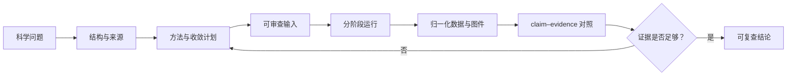

# Vibe-DFT-Skills

> **鸣谢 / Acknowledgement**
> 官方网页转 Markdown 使用
> [`helloworld-Co/html2md`](https://github.com/helloworld-Co/html2md)。
> Official HTML-to-Markdown conversion uses
> [`helloworld-Co/html2md`](https://github.com/helloworld-Co/html2md).

**从结构、输入和运行记录出发，建立可复查的计算证据。**

Vibe-DFT-Skills 是一组面向密度泛函理论与原子模拟工作的可移植
Skills。仓库当前包含 26 个 source-backed Skills：7 个处于 `active`
生命周期，19 个仍在 `development`。Quantum ESPRESSO、VASP、CP2K 和
SIESTA 是当前四条 active 计算代码路线。

一次严谨计算并不始于提交作业，也不止于输出文件中的正常结束标记。它始于
一个可检验的问题：需要比较什么物理量，哪些近似可以接受，什么数值误差会
改变结论。随后才是结构来源、方法选择、参数收敛、计算执行、数据归一化和
结果解释。这个仓库把这些环节写成可检查的契约、确定性工具和官方资料路由，
使每一次决定都能回到输入、文档与产物。

The repository is an evidence-oriented workflow layer for reproducible DFT and
atomistic calculations. It keeps scientific intent, source provenance,
execution state, numerical convergence, and result acceptance as separate
records instead of compressing them into a single “successful run”.

最后更新：2026-07-27（Asia/Shanghai）

## 一条计算如何形成证据



仓库在这条链上坚持几项简单但严格的区分：

- 输入语法正确，不等于计算方法适合研究问题。
- 程序正常退出，不等于 SCF、几何或目标 observable 已收敛。
- 一组参数通过，不等于另一种结构、赝势、磁态或软件版本可以直接比较。
- 图已经画出，不等于数据来源、单位和父任务完整。
- deterministic test 证明工具行为，不证明外部软件完成了原生计算，也不证明
  物理结论成立。

这些边界贯穿 `SKILL.md`、JSON contracts、registries、fixtures 和命令行
validators。Agent 可以据此规划和检查工作，但改变研究路线、结果接受标准或
论文主张的决定仍由研究者作出。

## 当前可路由的计算链

| Skill | 在计算链中的职责 | 主要证据产物 |
|---|---|---|
| `cif-structure-analysis` | 读取 CIF，检查占位、无序、周期近邻、对称性和结构身份 | `structure-manifest@1.0` |
| `qe-rigorous-calculations` | 规划和审计 Quantum ESPRESSO 输入、运行、restart 与 observable 收敛 | `run-manifest@1.0` |
| `vasp-rigorous-calculations` | 规划和审计 VASP 输入、输出、赝势 metadata 与结果可比性 | `run-manifest@1.0` |
| `cp2k-rigorous-calculations` | 规划和审计 CP2K Quickstep、结构优化、MD 与电子结构工作流 | `run-manifest@1.0` |
| `siesta-rigorous-calculations` | 规划和审计 SIESTA FDF、基组、网格、restart 与派生任务 | `run-manifest@1.0` |
| `dft-postprocess` | 盘点父任务、抽取数据、检查单位和 lineage、生成可追溯图件 | `normalized-dataset@1.0`, `artifact-manifest@1.0` |
| `dft-campaign-efficiency` | 在不降低科学门槛的前提下记录成本、失败路径和可复用经验 | `campaign-record@1.0`, `recommendation-record@1.0` |

`active` 表示仓库允许安装与路由，不表示当前机器已经安装相应可执行程序，也
不表示任一具体计算已通过科学验收。

## 计算目录与动态任务书

计算端使用稳定、可审查的目录，而不是把输入、restart、临时输出和最终图件
堆在同一位置：

```text
00-governance/
  plans/
  taskbook-revisions/
01-structures/
02-inputs/<stage-id>/<input-set-id>/
03-runs/<stage-id>/<attempt-id>/
  00-attempt/events/
04-derived/
05-figures/
06-reports/
90-archive/
```

[`tools/manage_calculation_workspace.py`](tools/manage_calculation_workspace.py)
负责生成逐文件哈希绑定的 input-set、把输入物化到彼此隔离的 attempt、维护
attempt event 与不可变 taskbook revision chains，并检查 active workdir。
文件所在目录只表示工作流位置，不自动授予它“已执行”“已收敛”或“可用于
论文”的状态。

任务开始前可以选择三种协作模式：

| 模式 | 行为 |
|---|---|
| `off` | 保留工整目录和 attempt 审计，不建立动态任务书。 |
| `silent-update` | Agent 按里程碑静默更新任务书，普通阶段不暂停；既有执行权限与科学路线仍需单独成立。 |
| `milestone-review` | 先把 workflow plan 与逐文件 input-set 的精确 hash 交给用户审核；批准后才可初始化相应 attempt。后续结构、输入、运行、数据、图件和报告先记录为 `pending-review` 并暂停，再由新 revision 记录批准。 |

初次审核使用返回的 taskbook SHA-256 拒绝陈旧批准；任何输入 byte 或 plan
变化都必须使用新 identity 重新审核。运行中的 attempt 会使
`check --require-quiescent` 失败，从而阻止 Agent 在写入期间整理、移动或
归档目录。这里记录的是“审核就绪”，不替代 execution request、human
decision、lease、site policy 或 scientific acceptance。

详细的数据布局、revision 规则和用户决定边界见
[`docs/calculation-workspace-and-taskbook.md`](docs/calculation-workspace-and-taskbook.md)。

## 官方手册：本地正文，Git 中保存证据

参数默认值、允许范围、前置条件和版本差异应尽可能回到第一方手册。仓库因此
把“手册正文”和“手册证据”分开管理：

- Git 保存 source identity、版本、receipt、hash、scope、slice metadata、
  路由和重建工具。
- 完整正文位于本地 cache，不把第三方手册正文复制进仓库。
- 每个 source-backed Skill 都有一级
  `references/manual-cache-route.md`，Agent 不必从一个目录页反复追踪二级
  HTML 链接。
- HTML 经 pinned `html2md` 转换；Markdown、RST、JSON、source text 和 PDF
  使用各自的保真路径。
- UTF-8、替换字符、NUL、不可见控制字符、输出大小和逐文件 SHA-256 都在
  cache 提交前检查。

2026-07-26 的本地技术快照包含 26 个 Skills、14,635 份 Markdown 或
metadata-route 文档。四条 active provider 路线的检查结果包括：

| Provider | 本地物化与链接检查 |
|---|---|
| CP2K 2026.2 | 3,030 个页面；66,791 个内部链接通过 |
| SIESTA 5.4.2 | 104 个 source documents；89 个 rendered pages、15 个 source-only pages；1,333 个内部链接通过 |
| Quantum ESPRESSO | 36 份 executable input manuals、1,231 个 sections；5 份 guides、95 页；121 个 release-note sections；11 份 PDF、171 页 |
| VASP Wiki | 1,297 个请求标题解析为 1,091 个唯一页面；provider 报告 public body 与上游枚举闭合 |

使用以下命令建立或核对本地缓存：

```bash
python3 tools/sync_official_manual_cache.py --inventory
python3 tools/sync_official_manual_cache.py --refresh
python3 tools/sync_official_manual_cache.py --check
python3 tools/sync_official_manual_cache.py --check-routing-docs
```

完整规则见
[`docs/official-manual-markdown-cache.md`](docs/official-manual-markdown-cache.md)；
逐 Skill 数量、provider 证据与缺口见
[`docs/official-manual-cache-status.md`](docs/official-manual-cache-status.md)。

### 已知缺口与保留边界

缺失的上游正文不会由搜索摘要、第三方转载或猜测内容填补。当前 ledger 为：

| ID | 范围 | 当前状态 |
|---|---|---|
| `OM-GAP-001` | Multiwfn 的 2 个外部 PDF routes | 正文无法通过已注册来源取得；保持 metadata-only |
| `OM-GAP-002` | MACE ReadTheDocs search index | index body 不可得；pinned 完整文档树已单独物化 |
| `OM-GAP-003` | LASP/LOBSTER 的 12 个 publisher records | 属于文献 provenance，不作为软件手册正文 |
| `OM-GAP-004` | SIESTA 的 `Interactions.png`、`RectangularMatrix.png` | 页面引用资源在上游缺失；正文与 source 已保留 |
| `OM-GAP-005` | VASP Wiki 的 10 个标题 | 缺失或不可公开读取；逐项保留 provider outcome |
| `OM-GAP-006` | 4 个 Fair-Chem/MACE/NequIP source-tree records | 有意保持 nonmanual metadata；代码树不伪装成参数手册 |

关闭条件、影响范围和复查命令记录在
[`docs/official-manual-cache-status.md`](docs/official-manual-cache-status.md)。
这些缺口也是 ordinary bundle audit 仍保持
`0 complete / 26 partial / 0 missing / 0 invalid` 的原因之一。这个保守状态
不是缓存失败，而是拒绝用 registration 或 URL 列表替代正文与语义审查。

## Development：已经有源码，尚未获得路由资格

19 个 `development` Skills 用于继续建设跨阶段的科学工作流：

- 规划与治理：`dft-project-orchestrator`、`dft-hpc-execution`、
  `dft-reporting`、`literature-to-dft-plan`、`dft-review-response`。
- 结构构建：`dft-structure-preparation`。
- 计算与模拟：`gaussian-rigorous-calculations`、
  `gromacs-rigorous-simulations`、`lammps-rigorous-simulations`、
  `deepmd-rigorous-workflows`、`ml-potential-workflows`、
  `gpumd-rigorous-simulations`、`lasp-rigorous-simulations`。
- 分析与后处理：`multiwfn-wavefunction-analysis`、
  `phonopy-rigorous-workflows`、`vaspkit-postprocess`、
  `catmap-microkinetics`、`lobster-bonding-analysis`、
  `ovito-atomistic-analysis`。

这些目录接受仓库测试，但保持不可安装、不可路由、无外部 action，并以
`no_positive_claim` 为最高声明。源码存在不是支持声明；promotion 必须有
独立审查、activation profile、确定性 fixtures、provenance、failure
semantics 和全库 audit。

生命周期与路径的唯一权威是
[`registry/skill-registry.yaml`](registry/skill-registry.yaml)；软件身份和环境
要求分别由
[`registry/software-registry.yaml`](registry/software-registry.yaml) 与
[`registry/environment-profiles.yaml`](registry/environment-profiles.yaml)
管理。

## 开始使用

仓库工具只依赖明确记录的 Python 开发环境：

```bash
python3 -m venv .venv
. .venv/bin/activate
python3 -m pip install -r requirements-dev.txt
```

先运行离线验证，再安装 active Skills：

```bash
python3 tools/run_tests.py
python3 tools/validate_all_skills.py
python3 tools/install_skills.py --target /path/to/codex/skills
```

也可以直接阅读某个 `skills/<skill-id>/SKILL.md`，或调用相应
`scripts/` 下的确定性 CLI。核心 contracts 与 tools 不依赖特定 Agent
vendor；`agents/openai.yaml` 只是可选的集成 metadata。

## 仓库结构

```text
skills/       Skill 入口、一级 references、确定性脚本和合成 fixtures
contracts/    跨 Skill 的 JSON Schema 与版本迁移契约
registry/     lifecycle、软件、环境、接口、路由和官方来源身份
tools/        构建、验证、缓存、安装、任务书与仓库审计工具
tests/        仓库级离线测试
docs/         科学边界、维护约定、缓存状态和 promotion 规则
```

运行时经验数据库、真实计算树、未发表数值、凭据、私有主机信息和受限制的
potential 正文不进入 Git。测试与示例使用匿名标识和 synthetic fixtures。

## 提交前验证

```bash
python3 tools/run_tests.py
python3 tools/run_development_tests.py
python3 tools/validate_all_skills.py
python3 tools/audit_repository.py
python3 tools/build_official_document_packs.py --all --check
python3 tools/sync_official_manual_cache.py --check
python3 tools/sync_official_manual_cache.py --check-routing-docs
python3 tools/validate_official_document_storage.py --strict-release
git diff --check -- . ':(exclude)skills/qe-rigorous-calculations/references/official-*'
```

测试通过只支持与测试内容相称的声明。涉及真实研究结果时，还必须保留结构
来源、输入身份、软件与方法、restart lineage、关键收敛证据、结果位置和已知
限制。

维护规则见 [`AGENTS.md`](AGENTS.md)，接口扩展见
[`docs/integration-and-extension-plan.md`](docs/integration-and-extension-plan.md)，
promotion 规则见
[`docs/lifecycle-promotion-policy.md`](docs/lifecycle-promotion-policy.md)。
