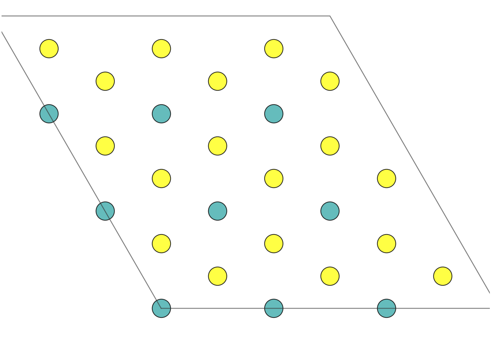
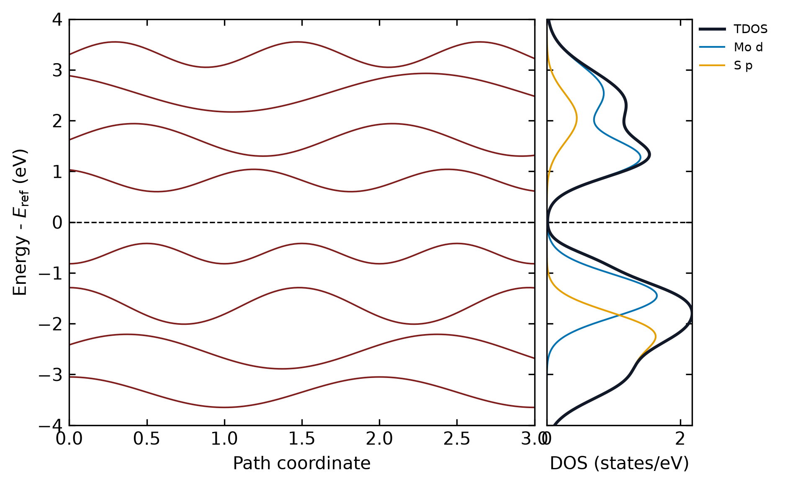
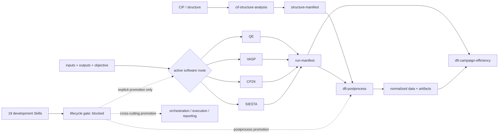

# Vibe-DFT-Skills

<p align="center">
  <strong>Portable, evidence-gated Skills for reproducible DFT and atomistic workflows</strong><br>
  <strong>面向可重复 DFT 与原子模拟工作流的可移植、证据门禁 Skill 集合</strong>
</p>

> **最后更新 / Last updated:** 2026-07-23 (Asia/Shanghai)
> **仓库状态 / Repository scope:** 26 source-backed Skills = 7 `active` + 19 `development`; 4 active calculation-code integrations; 19 planned software identities

> **项目声明 / Project statement**
>
> 本Skill集合的唯一目的是让Agent即使装载的是低推理能力LLM模型，也能在本Skills的协作下构建可重复的严谨DFT计算，降低LLM和人工成本，降低对于DFT的计算部分的学习门槛，并且希望能依托轻量模型的快速响应的优势，去高频有效的分析我们的计算细节。在理想的情况下，减少长耗时的无效DFT计算，让我们的idea更快得到验证
>
> The sole purpose of this Skill collection is to help agents, including those backed by lower-reasoning LLMs, build reproducible and rigorous DFT workflows through coordinated Skills. It aims to reduce model and human cost, lower the learning barrier to practical DFT calculations, and use the fast response of lightweight models to inspect calculation details frequently and effectively. Ideally, this reduces long, unproductive calculations and lets research ideas be tested sooner.

Vibe-DFT-Skills packages calculation guidance, official-source provenance, deterministic Python gates, shared JSON contracts, synthetic fixtures, and extension registries. The core is not tied to Codex or any other agent vendor: a compatible runtime may load `SKILL.md`, a workflow may call the Python CLIs directly, and a maintainer may use the repository as a maintained knowledge and interface layer.

Vibe-DFT-Skills 将计算规范、官方来源、确定性 Python 门禁、共享 JSON 契约、合成夹具和扩展注册表放在同一仓库中。核心层不绑定 Codex 或其他 Agent 厂商：兼容的运行时可以载入 `SKILL.md`，普通工作流可以直接调用 Python CLI，维护者也可以把本库作为经过检查的知识与接口层。

## 展示 / Showcase

<table>
  <tr>
    <td width="42%" align="center">
      <br>
      <sub>CIF 静态 c 轴投影 / static c-axis projection</sub>
    </td>
    <td width="58%" align="center">
      <br>
      <sub>能带–TDOS/PDOS 联合图 / combined bands–TDOS/PDOS plot</sub>
    </td>
  </tr>
</table>

展示图由仓库代码从合成夹具生成，只用于功能演示，不是参考结构或科研结果。运行 `python3 docs/showcase/generate_showcase.py` 可重新生成。

The figures are generated from synthetic fixtures by repository code. They demonstrate functionality only and are not reference structures or scientific results. Regenerate them with `python3 docs/showcase/generate_showcase.py`.

## 生命周期与证据边界 / Lifecycle and evidence boundary

| Lifecycle | 数量 / Count | 含义 / Meaning |
|---|---:|---|
| `active` | 7 | 源码位于 `skills/`，可由安装器选择并由注册路由调用；仍须通过任务自己的证据门禁。 / Source-backed, installable, and routable, while still subject to task-specific evidence gates. |
| `development` | 19 | 已有源码并接受仓库校验，但不可安装、不可路由、无 action、handoff blocked，最高只能是 `no_positive_claim`。 / Source-backed maintenance work that remains non-installable, non-routable, action-free, handoff-blocked, and capped at `no_positive_claim`. |
| `planned` Skill | 0 | 只保留身份时必须使用 `path: null`，不能存在同名源码目录。 / Identity-only entries use `path: null` and have no source tree. |
| `planned` software | 19 | 软件身份、环境 profile 和激活要求的预留；不表示相应软件已安装、受支持或经过原生验证。 / Reserved software identities and activation profiles; not an installation, support, or native-validation claim. |

这里严格区分五件事：源码存在、生命周期注册、仓库确定性测试、当前环境可用性、外部软件原生运行。`active` 只说明本仓库允许安装与路由，不说明本机已安装 QE、VASP、CP2K 或 SIESTA。除非另有明确记录，测试使用合成夹具、可公开记录的产物和离线资料，不构成外部软件的原生执行证据。

Status reporting separates source presence, lifecycle registration, deterministic repository tests, environment availability, and native execution. `active` means repository-installable and routable; it does not mean QE, VASP, CP2K, or SIESTA is installed locally. Unless explicitly recorded otherwise, tests use synthetic fixtures, redistributable recorded artifacts, and offline material rather than native third-party runs.

## 官方网站与上游资料索引 / Official websites and upstream sources

下列链接于 2026-07-22 现场核验，覆盖本库直接关联的科学软件、标准和执行基础设施。这个索引只用于定位第一方资料：列出官网不表示本机已安装、仓库已支持、上游项目为本库背书或已经完成原生验证。精确 lifecycle 以 [`registry/software-registry.yaml`](registry/software-registry.yaml) 和 [`registry/skill-registry.yaml`](registry/skill-registry.yaml) 为准；版本、平台、许可和阻断项以 [`registry/environment-profiles.yaml`](registry/environment-profiles.yaml) 及各 Skill 的 version-pinned references 为准。通用 Python/构建依赖见 `requirements-dev.txt`，不在这里逐项罗列。

The links below were checked on 2026-07-22 and cover the scientific upstreams, standards, and execution infrastructure directly represented by this repository. This is a provenance and navigation index, not an installation, support, endorsement, or native-validation claim. The registries remain authoritative for lifecycle and environment state; version-specific deep links remain in each Skill's references.

### Active 计算代码集成 / Active calculation-code integrations

这四个 `active` 软件身份具有仓库路由，但仍不能据此推导当前机器存在可执行程序或某个任务已经通过科学验收。

| Registry ID | 软件 / Software | 关联 Skill / Related Skill | 官方入口 / Official entry points |
|---|---|---|---|
| `qe` | Quantum ESPRESSO | `qe-rigorous-calculations` | [官网](https://www.quantum-espresso.org/) · [官方文档索引](https://www.quantum-espresso.org/Doc/) · [7.5 `pw.x` 输入文档](https://www.quantum-espresso.org/Doc/INPUT_PW.html) |
| `vasp` | VASP | `vasp-rigorous-calculations` | [官网](https://vasp.at/) · [VASP Wiki / official manual](https://vasp.at/wiki/Main_page) |
| `cp2k` | CP2K | `cp2k-rigorous-calculations` | [官网](https://www.cp2k.org/) · [2026.2 官方手册](https://manual.cp2k.org/cp2k-2026_2-branch/) |
| `siesta` | SIESTA | `siesta-rigorous-calculations` | [官网](https://siesta-project.org/siesta/) · [5.4 官方文档](https://docs.siesta-project.org/projects/siesta/en/5.4/) |

### Development Skill 对应的软件身份 / Planned software identities for development Skills

以下 19 个 registry identity 均为 `software: planned`，其关联 Skill 均为 `development`：不可安装、不可路由、不会启动外部软件，也没有原生验证或正向科学声明。这里的 rolling 官网入口用于发现当前资料；本库采用的精确版本仍由 profile 和 Skill reference 固定。

| Registry ID | 软件与关联 Skill / Software and Skill | 官方入口 / Official entry points | 许可或访问边界 / License or access boundary |
|---|---|---|---|
| `gaussian` | Gaussian · `gaussian-rigorous-calculations` | [Gaussian, Inc.](https://gaussian.com/) · [User's Reference](https://gaussian.com/man/) · [release notes](https://gaussian.com/relnotes/) | 专有商业软件；公开网页不授予二进制、源码或安装介质的再分发权。 / Proprietary and licensed. |
| `gromacs` | GROMACS · `gromacs-rigorous-simulations` | [官网](https://www.gromacs.org/) · [官方手册](https://manual.gromacs.org/) · [官方 GitLab](https://gitlab.com/gromacs/gromacs) | `LGPL-2.1-or-later`；手册 major/minor 应匹配安装版本。 |
| `lammps` | LAMMPS · `lammps-rigorous-simulations` | [官网](https://www.lammps.org/) · [官方手册](https://docs.lammps.org/) · [官方 GitHub](https://github.com/lammps/lammps) | 普通发行版为 `GPL-2.0-only`；build packages 和势文件另行核验。 |
| `deepmd` | DeePMD-kit · `deepmd-rigorous-workflows` | [官方文档](https://docs.deepmodeling.com/projects/deepmd/en/stable/) · [官方 GitHub](https://github.com/deepmodeling/deepmd-kit) | 框架为 `LGPL-3.0-or-later`；数据、模型和第三方 backend 单独授权。 |
| `multiwfn` | Multiwfn · `multiwfn-wavefunction-analysis` | [作者官网](http://sobereva.com/multiwfn/) · [下载与许可](http://sobereva.com/multiwfn/download.html) | 当前官方站可靠入口为 HTTP；使用自定义许可与引用要求，不自行改写为 SPDX 许可。 |
| `phonopy` | Phonopy · `phonopy-rigorous-workflows` | [官方文档](https://phonopy.github.io/phonopy/) · [安装](https://phonopy.github.io/phonopy/install.html) · [官方 GitHub](https://github.com/phonopy/phonopy) | `BSD-3-Clause`；force calculator、赝势和输入数据仍有独立来源。 |
| `vaspkit` | VASPKIT · `vaspkit-postprocess` | [项目官网](https://vaspkit.com/) · [官方文档源码](https://github.com/vaspkit/vaspkit.github.io) · [官方二进制发布](https://sourceforge.net/projects/vaspkit/files/Binaries/) | 官网当前存在 TLS/DNS 不稳定，后两项为官方备用入口；免费使用不等于开源或可再分发。 |
| `catmap` | CatMAP · `catmap-microkinetics` | [官方文档](https://catmap.readthedocs.io/en/latest/) · [SUNCAT 官方 GitHub](https://github.com/SUNCAT-Center/catmap) | `GPL-3.0`；输入能量、数据库和可执行 `.mkm` 配置另行审查。 |
| `lobster` | LOBSTER · `lobster-bonding-analysis` | [RWTH 官方主页](https://schmeling.ac.rwth-aachen.de/cohp/index.php?menuID=1) · [下载/版本入口](https://schmeling.ac.rwth-aachen.de/cohp/index.php?menuID=6) | 受限、实名注册、非营利科研许可；二进制、手册和随包资源不得提交。 |
| `ovito` | OVITO · `ovito-atomistic-analysis` | [官网](https://www.ovito.org/) · [官方文档](https://docs.ovito.org/) · [许可与版本边界](https://docs.ovito.org/licenses/index.html) | Basic/Python module 与 Pro 是不同许可面；Pro 需要付费 entitlement。 |
| `pymatgen` | pymatgen · `dft-structure-preparation` | [官网与文档](https://pymatgen.org/) · [Materials Project 官方 GitHub](https://github.com/materialsproject/pymatgen) | `MIT`；wrapper/core 版本拆分记录，但仍是一个 registry software identity。 |
| `rdkit` | RDKit · `dft-structure-preparation` | [官网](https://www.rdkit.org/) · [官方文档](https://www.rdkit.org/docs/) · [官方 GitHub](https://github.com/rdkit/rdkit) | `BSD-3-Clause`；官网可能对自动化客户端返回 406，分子清洗、立体化学和构象结果仍需任务门禁。 |
| `mace` | MACE · `ml-potential-workflows` | [官方文档](https://mace-docs.readthedocs.io/en/latest/) · [ACEsuit 官方 GitHub](https://github.com/ACEsuit/mace) | 框架为 `MIT`；foundation-model/checkpoint 许可逐个核验。 |
| `nequip` | NequIP · `ml-potential-workflows` | [项目门户](https://www.nequip.net/) · [官方文档](https://nequip.readthedocs.io/en/latest/) · [官方 GitHub](https://github.com/mir-group/nequip) | 框架为 `MIT`；模型、扩展和编译产物可采用不同许可。 |
| `gpumd` | GPUMD · `gpumd-rigorous-simulations` | [官方文档](https://gpumd.org/) · [官方 GitHub](https://github.com/brucefan1983/GPUMD) | `GPL-3.0-or-later`；NEP 势、训练集和第三方接口独立核验。 |
| `lasp` | LASP · `lasp-rigorous-simulations` | [LASP Hub 下载页](http://www.lasphub.com/#/lasp/download) · [复旦大学课题组官方页](https://faculty.fudan.edu.cn/fdzpliu/zh_CN/zhym/644124/list/index.htm) | 商业版权软件；LASP Hub 当前可靠入口为 HTTP，未发现可核验的官方公共 GitHub 仓库。 |
| `gemnet-oc` | GemNet-OC · `ml-potential-workflows` | [FAIR-Chem 官方文档](https://fair-chem.github.io/) · [v1 model catalog](https://fair-chem.github.io/models-1/) · [官方 GitHub](https://github.com/facebookresearch/fairchem) | 预留的 FairChem v1 路线；代码许可不能替代具体 checkpoint 许可。 |
| `equiformer-v2` | EquiformerV2 · `ml-potential-workflows` | [FAIR-Chem 官方文档](https://fair-chem.github.io/) · [v1 model catalog](https://fair-chem.github.io/models-1/) · [官方 GitHub](https://github.com/facebookresearch/fairchem) | 预留的 FairChem v1 路线；模型身份、任务头和工件哈希必须独立绑定。 |
| `fairchem-uma` | FAIR-Chem UMA · `ml-potential-workflows` | [FAIR-Chem 官方文档](https://fair-chem.github.io/) · [UMA 文档](https://fair-chem.github.io/uma/) · [官方 GitHub](https://github.com/facebookresearch/fairchem) | 代码为 `MIT`；UMA checkpoint 是 gated model，并受独立模型许可约束。 |

### 标准、直接依赖与执行基础设施 / Standards, direct dependencies, and execution infrastructure

这些项目直接支撑 active Skill 或 development 设计，但不是额外的 active calculation-code route。

| 上游项目 / Upstream | 本库关系 / Repository relationship | 官方入口 / Official entry points |
|---|---|---|
| IUCr CIF | `cif-structure-analysis` 的晶体学标准权威；自动化客户端可能被 IUCr WAF 阻断。 | [CIF resources](https://www.iucr.org/resources/cif) · [CIF 1.1 syntax](https://www.iucr.org/resources/cif/spec/version1.1/cifsyntax) |
| ASE | `cif-structure-analysis` 的直接依赖，并为 `dft-structure-preparation` 提供结构 API。 | [官网](https://ase-lib.org/) · [官方文档](https://docs.ase-lib.org/) |
| Gemmi | CIF 解析与交叉核对依赖。 | [官方 GitHub](https://github.com/project-gemmi/gemmi) · [官方文档](https://gemmi.readthedocs.io/en/stable/) |
| PyCifRW | CIF parser 依赖；PyPI 当前元数据指向项目官方仓库。 | [官方 GitHub](https://github.com/jamesrhester/pycifrw) · [PyPI release channel](https://pypi.org/project/PyCifRW/) |
| spglib | `cif-structure-analysis` 的对称性依赖；在 `dft-structure-preparation` 中仅是 reference-only cross-check。 | [官方 GitHub](https://github.com/spglib/spglib) · [官方文档](https://spglib.readthedocs.io/en/stable/) |
| Slurm | `dft-hpc-execution` 的文档来源；当前没有真实集群 adapter 或 active route。 | [官方概览](https://slurm.schedmd.com/overview.html) · [官方文档](https://slurm.schedmd.com/documentation.html) |

## 当前 active 模块 / Active modules

| Skill | 软件与官网 / Software and official site | 功能 / Function | 优点、局限与采用理由 / Strengths, limits, and why included |
|---|---|---|---|
| `cif-structure-analysis` | [IUCr CIF](https://www.iucr.org/resources/cif), [ASE](https://docs.ase-lib.org/), [Gemmi](https://gemmi.readthedocs.io/en/stable/), [PyCifRW](https://github.com/jamesrhester/pycifrw), [spglib](https://spglib.readthedocs.io/en/stable/) | 解析 CIF1/CIF2、数据块与原始标签；保留不确定度和占位警告；分析周期近邻、配位、目标元素对/键长、对称性和静态投影。 / Parse CIF metadata and structures; inspect uncertainty, occupancy, periodic neighbors, coordination, target bond lengths, symmetry, and static projections. | 多解析器交叉保留晶体学证据，适合作为结构入口；无序、部分占位和“键”的化学含义仍需人工/方法判断。 / Traceable multi-parser entry point; disorder, partial occupancy, and chemical bond meaning remain explicit limitations. |
| `qe-rigorous-calculations` | [Quantum ESPRESSO](https://www.quantum-espresso.org/) · [official input documentation](https://www.quantum-espresso.org/Doc/INPUT_PW.html) | `pw.x`、`ph.x`、`neb.x` 等平面波/赝势 DFT 工作流的输入设计、官方参数解析、运行审计、重启谱系和可观测量收敛。 / Evidence-gated input design, official-parameter resolution, run auditing, restart lineage, and observable-specific convergence for QE. | 开源、方法和后处理生态广，便于复现与扩展；输入程序多、单位/默认值和赝势选择复杂。选作开放周期 DFT 主路线。 / Open and extensible with broad methods; multi-program semantics and pseudopotential/convergence choices require strict gates. |
| `vasp-rigorous-calculations` | [VASP](https://vasp.at/) · [VASP Wiki](https://vasp.at/wiki/) | 审计 INCAR、POSCAR、KPOINTS、POTCAR 元数据、OUTCAR/`vasprun.xml`、完成性、收敛及高级方法。 / Audit inputs, outputs, completion, convergence, and advanced VASP workflows. | 固体材料工作流成熟、应用广；软件和 POTCAR 受许可约束，参数相互作用复杂。因实际材料计算覆盖率高而保留，但永不提交 POTCAR 内容。 / Mature and widely used, but proprietary and parameter-coupled; licensed content never enters Git. |
| `cp2k-rigorous-calculations` | [CP2K](https://www.cp2k.org/) · [2026.2 manual](https://manual.cp2k.org/cp2k-2026_2-branch/) | Quickstep、GPW/GAPW、基组/赝势、周期与分子体系、优化、MD、振动和高级方法的设计与审计。 / Plan and audit CP2K GPW/GAPW calculations across molecular, periodic, optimization, MD, and response tasks. | 对混合体系、分子动力学和多种理论层级灵活，开源且并行能力强；输入树、基组和网格组合复杂。用于补足纯平面波路线。 / Flexible open framework for mixed systems and MD; input hierarchy and basis/grid convergence are demanding. |
| `siesta-rigorous-calculations` | [SIESTA](https://siesta-project.org/siesta/) · [5.4 documentation](https://docs.siesta-project.org/projects/siesta/en/5.4/) | FDF 输入、数值原子轨道、PSF/PSML/VPS、完成性、父任务/重启、能带/DOS/声子/输运等任务边界。 / Audit SIESTA FDF, localized bases, pseudopotentials, lineage, completion, and task-specific evidence. | 局域基组适合较大体系并提供 TranSIESTA/TBtrans 方向；基组依赖和 mesh/k 点收敛不能照搬平面波经验。用于覆盖局域轨道和输运路线。 / Efficient localized-orbital route for larger systems and transport; basis dependence requires separate convergence evidence. |
| `dft-postprocess` | Repository Python tools; optional adapters to the calculation codes and external analysis packages | 盘点、抽取、归一化、验证、分析与绘图，输出 postprocess plan、tool execution、normalized dataset 和 artifact manifest。 / Inventory, extract, normalize, validate, analyze, and plot DFT outputs with provenance-bearing artifacts. | 统一数据/图件接口并减少重复脚本；成熟度必须按 `code × observable × backend` 单独检查，图画出来不等于科学结论成立。 / Shared deterministic data and figure layer; every backend/observable route remains independently maturity-gated. |
| `dft-campaign-efficiency` | Repository Python tools | 记录 wall time、core-hours、存储、失败、重跑和关键路径，形成隐私安全的 campaign record 与证据分级建议。 / Normalize campaign cost and failure evidence into comparable records and recommendations. | 把计算经验变成可审计建议且不改动计算；跨体系可迁移性有限，建议不得降低科学验收标准。 / Turns experience into traceable advice without editing calculations; recommendations remain evidence-ranked and system-specific. |

## Development 模块 / Development modules

这些模块已有详细源码、参考资料、门禁和测试，但在完成匹配版本的官方资料审查、合法真实产物、原生执行、科学边界和端到端验收前保持不可路由。目录丰富不等于软件已经可用。

These modules have source, references, gates, and tests, but remain non-routable until version-matched primary documentation, legally reusable real artifacts, native execution, scientific limits, and end-to-end acceptance are complete. Source depth is not a support claim.

2026-07-22 的内容优先回填为全部 19 个 `development` Skills 增加了可直接用于规划、审查和故障定位的实操 playbook：包括任务分解、关键输入、父任务谱系、单位与格式、restart、输出验收、常见失效、收敛与科学边界。软件命令和版本行为优先绑定官网手册或官方源码；公开资料不足的 LASP、受许可约束的 LOBSTER/Gaussian 等路线保持 fail closed。此次回填没有改变任何 lifecycle、路由、安装、action、native-validation 或 claim-ceiling 状态。

The 2026-07-22 content-first pass adds planning, audit, and troubleshooting playbooks to all 19 `development` Skills, covering task decomposition, decisive inputs, parent lineage, units and formats, restart semantics, output acceptance, common failures, convergence, and scientific limits. Commands and version behavior are tied to official manuals or upstream source where available; sparsely documented or licensed surfaces remain fail closed. This pass changes no lifecycle, routing, installation, action, native-validation, or claim-ceiling state.

### 跨软件协作 / Cross-cutting modules

| Skill | 功能 / Function | 当前价值与限制 / Present value and limit |
|---|---|---|
| `dft-project-orchestrator` | 将结构、计算、后处理和效率任务组织为显式 workflow plan、decision record 与 execution request。 / Build explicit plans and decisions across structure, calculation, postprocessing, and campaign Skills. | 提供状态与授权边界；真实跨 Skill 执行仍被 development 路由阻断。 / Defines state and authorization boundaries; real cross-Skill execution remains blocked. |
| `dft-hpc-execution` | 用 request、lease、record 和 event 描述调度器执行、恢复与取消；外部参考以 [Slurm 官方文档](https://slurm.schedmd.com/documentation.html) 为主。 / Model scheduler execution, lease, recovery, cancellation, and events; use the official Slurm documentation as the external reference. | 先解决副作用与幂等性问题；尚不代表任何真实集群适配器已可用或经过测试。 / Establishes side-effect and idempotency contracts; no real cluster adapter is claimed or tested. |
| `dft-reporting` | 将 claim 与 evidence、图件和 campaign 记录绑定为报告。 / Bind claims to evidence, figures, and campaign records. | 防止报告超出证据；不替代作者对科学叙事和引用的审核。 / Prevents evidence-free reporting; does not replace author review. |
| `literature-to-dft-plan` | 区分论文事实、推断和待验证假设，形成可执行计算计划。 / Separate literature facts, inference, and hypotheses into a calculation plan. | 约束“从论文直接抄参数”；检索完整性、版权和体系可比性仍需审查。 / Avoids blind parameter copying; retrieval completeness and comparability still need review. |
| `dft-review-response` | 把审稿意见拆成 claim、已有证据、缺口和补算决策。 / Map review comments to claims, evidence gaps, and calculation decisions. | 让补算有证据边界；不能自动决定研究主张或替代作者判断。 / Makes requested evidence explicit; cannot decide the scientific position for the author. |

### 软件相关模块 / Software-facing modules

| Skill | 软件与官网 / Software and official site | 上游软件能力或预定范围 / Upstream or intended scope | 当前 Skill 实现与成熟度 / Current implemented surface and maturity | 优点、局限与采用理由 / Strengths, limits, and why included |
|---|---|---|---|---|
| `dft-structure-preparation` | [pymatgen](https://pymatgen.org/), [RDKit](https://www.rdkit.org/) | 周期/分子结构转换、标准化、超胞/表面/缺陷准备和导出。 / Periodic and molecular structure preparation and export. | 已形成 lineage、site mapping 和有损转换门禁，并对 ASE/pymatgen 做临时目录 API smoke；RDKit 和缺陷扩展尚未原生运行，整体仍为 development。 / Candidate lineage and loss gates include temporary ASE/pymatgen API smokes; RDKit and defect extensions remain native-not-run. | 两个生态互补且 I/O 成熟；格式转换可能重排原子或丢失占位、电荷和键语义，因此纳入统一 provenance。 / Complementary mature libraries whose lossy transformations require shared provenance. |
| `gaussian-rigorous-calculations` | [Gaussian](https://gaussian.com/) | 分子量子化学输入、优化、频率、checkpoint 和电子结构任务。 / Molecular quantum chemistry, optimization, frequencies, and checkpoints. | 当前为版本化官方目录、离线计划/输入输出门禁和合成夹具；不启动 `g16`，不声称 native completion。 / Versioned documentation catalog and offline guards only; it does not launch `g16`. | 方法覆盖广；专有许可和平台差异要求隔离。用于补足周期材料代码之外的分子任务。 / Broad molecular methods, with proprietary and platform boundaries. |
| `gromacs-rigorous-simulations` | [GROMACS](https://www.gromacs.org/) · [manual](https://manual.gromacs.org/) | 拓扑准备、`grompp`、`mdrun`、checkpoint/restart 和轨迹分析。 / Topology, preprocessing, MD, restart, and analysis. | 当前目录和 guard 只生成/审计候选记录；不会启动 `gmx`、`grompp` 或 `mdrun`。 / Catalogs and guards audit candidate records; no GROMACS executable is launched. | 高性能生物分子 MD；力场、拓扑和采样有效性与 DFT 分离。用于延伸时间尺度。 / High-performance MD whose force-field and sampling validity remain separate. |
| `lammps-rigorous-simulations` | [LAMMPS](https://www.lammps.org/) · [manual](https://docs.lammps.org/) | 材料/粒子体系的经典或 ML 势 MD 与并行模拟。 / Classical or ML-potential atomistic simulation. | 当前固定命令/输入语义并离线审计 manifest、log 和 restart lineage；不启动 LAMMPS。 / Versioned command semantics and offline manifest/log/lineage checks; no native launch. | 极具扩展性；`units`、`atom_style`、势和 build package 改变语义。用于跨越 DFT 尺度。 / Flexible and scalable, with strongly configuration-dependent semantics. |
| `deepmd-rigorous-workflows` | [DeePMD-kit](https://docs.deepmodeling.com/projects/deepmd/en/stable/) | DFT 数据、训练、冻结/压缩、评估和 MD 部署。 / Dataset, training, model export, evaluation, and deployment. | 当前只校验计划、元数据、provenance 和合成记录；不导入 DeePMD、不读真实数组、不训练/冻结/部署。 / Metadata and synthetic-record guards only; no framework import, array ingestion, training, or deployment. | 训练/推理生态完整；数据覆盖、单位、版本和外推风险决定可信度。 / Integrated scalable ecosystem whose validity is data- and domain-limited. |
| `ml-potential-workflows` | [MACE](https://mace-docs.readthedocs.io/), [NequIP](https://nequip.readthedocs.io/), [FAIR-Chem/UMA](https://fair-chem.github.io/) | 多框架数据、训练、checkpoint、评估、部署和比较；预留 GemNet-OC、EquiformerV2、UMA。 / Cross-framework ML potentials, including reserved GemNet-OC, EquiformerV2, and UMA routes. | 当前提供 provider 目录、计划/lineage/外推门禁和合成夹具；不导入框架或加载 checkpoint。 / Provider catalogs and synthetic planning/lineage/extrapolation gates; no framework or checkpoint is loaded. | 支持按体系选择模型；框架、训练数据、参考能、许可和任务头不可直接比较。 / Enables model selection without hiding incompatible data, references, licenses, or task heads. |
| `gpumd-rigorous-simulations` | [GPUMD](https://gpumd.org/) | GPU MD、NEP、热输运和相关原子模拟。 / GPU MD, NEP, and thermal transport. | 已固定 v5.3 的无参数工作目录入口和 I/O/单位边界；确定性覆盖仍以解析型 LJ 合成夹具为主，未运行二进制，NEP/热输运保持受限。 / Pins the v5.3 working-directory invocation and I/O boundaries; deterministic coverage is synthetic and no binary was run. | 对 GPU/热输运高效；势版本、后端和统计收敛必须固定。 / Efficient, but potential, backend, and statistical convergence must be explicit. |
| `lasp-rigorous-simulations` | [LASP download](http://www.lasphub.com/#/lasp/download) · [author review](https://doi.org/10.1021/prechem.4c00060) | 全局势能面、神经网络势、过渡态和采样。 / Global PES exploration, neural potentials, transition states, and sampling. | 当前仅记录公开发行、可执行入口和 opaque artifact provenance；因授权手册/二进制不可得，输入语法、单位、完成标志和 restart 均阻断。 / Documentary inventory and opaque-artifact provenance only; input/output semantics remain blocked. | 适合复杂 PES；公开版本化证据有限，因此保留 fail closed。 / Valuable for difficult PES work, but public interface evidence is limited. |
| `multiwfn-wavefunction-analysis` | [Multiwfn](http://sobereva.com/multiwfn/) | 波函数、实空间、拓扑、轨道、布居、相互作用和谱图分析。 / Broad wavefunction and real-space analyses. | 当前提供官方菜单/recipe 目录、版本探针和离线 transcript/table 审计；不启动 Multiwfn。 / Official menu/recipe catalog and offline transcript/table checks; no native program launch. | 功能广且可脚本化；菜单、格式和分析定义易误用。用于连接量子化学输出与解释。 / Broad but menu- and definition-sensitive analysis. |
| `phonopy-rigorous-workflows` | [Phonopy](https://phonopy.github.io/phonopy/) | 力常数、band、DOS/PDOS、热力学、NAC、QHA、Grüneisen 和多计算器交接。 / Harmonic/quasi-harmonic properties and calculator handoffs. | 当前固定 v4.3.1 的 15 个入口、catalog、recipe 和 fail-closed 计划/产物检查；未执行原生 Phonopy/DFT。 / Pins v4.3.1 entry points, catalogs, recipes, and offline gates; no native Phonopy/DFT run. | 社区标准且接口广；力、超胞、映射和 q 网格必须收敛。v4 引入多项破坏性 CLI/默认值变化，旧脚本须按迁移指南核对。 / Standard multi-code layer; v4 has documented breaking CLI/default changes requiring migration review. |
| `vaspkit-postprocess` | [VASPKIT](https://vaspkit.com/) | VASP 输入准备、结构/k 路径、DOS/PDOS、能带、场、功函数、光学和 MD 分析。 / Broad menu/CLI VASP preparation and postprocessing. | 当前含 174 个任务号目录、官方调用方式与常用 recipe；确定性 parser 仅覆盖窄的合成 211/252 能带表路线，未运行 VASPKIT。 / 174-task catalog and documented recipes; deterministic parsing is limited to synthetic 211/252 band-table paths, with no native run. | 上手快、覆盖广；任务号/提示随版本变化，不能替代 VASP 父任务验收。 / Convenient and broad, but version-sensitive and subordinate to parent-run evidence. |
| `catmap-microkinetics` | [CatMAP](https://catmap.readthedocs.io/) | 从能量、热化学和反应网络构建微观动力学模型。 / Microkinetic modeling from energies and reaction networks. | 当前为官方 API/catalog 查询、输入/结果候选门禁和合成夹具；不导入或运行 CatMAP。 / Official API/catalog lookup and synthetic input/result guards; CatMAP is not imported or run. | 将 DFT 连接到动力学；网络、描述符和热化学假设主导结论。 / Connects DFT to kinetics, with assumption-sensitive outcomes. |
| `lobster-bonding-analysis` | [RWTH LOBSTER page](https://schmeling.ac.rwth-aachen.de/cohp/index.php?menuID=6) | COHP/COOP、键级、电荷和局域轨道投影。 / Local-orbital bonding projections and population analyses. | 当前仅有受限的候选输入/输出、版本/投影门禁和合成夹具；不启动 LOBSTER，也不输出正向成键结论。 / Restricted candidate I/O and projection guards with synthetic fixtures; no native run or positive bonding claim. | 成键分解直观；许可、兼容代码/基组、spilling 和投影质量是硬门禁。 / Interpretable bonding analysis with strict license and projection-quality gates. |
| `ovito-atomistic-analysis` | [OVITO](https://www.ovito.org/) | 粒子/轨迹 I/O、modifier pipeline、缺陷/结构/位移分析和渲染。 / Particle/trajectory pipelines, analysis, and rendering. | 当前提供结构/轨迹 inventory、pipeline spec、格式/单位/particle-id 门禁和合成测试；不导入或运行 OVITO。 / Inventory and pipeline contracts with unit/ID/format gates and synthetic tests; OVITO is not imported or run. | GUI 与 Python 兼顾探索和自动化；Basic/Pro 与格式映射必须显式，图像不替代证据。 / Strong GUI/Python workflow with edition and format boundaries. |

## 调用与联动 / Routing and collaboration



路由遵循以下顺序 / Route in this order:

1. 结构事实、近邻、配位、目标键长和 CIF 元数据 → `cif-structure-analysis`。 / Structure facts, neighbors, coordination, target distances, or CIF metadata → `cif-structure-analysis`.
2. 输入设计、运行完成性、重启、参数依据和收敛 → 按代码选择 QE、VASP、CP2K 或 SIESTA。 / Inputs, completion, restart, parameter evidence, or convergence → the matching calculation Skill.
3. 抽取、归一化、能带、DOS/PDOS、声子、EPC、场数据、NEB 或绘图 → `dft-postprocess`，并先查 `code × observable × backend` 成熟度。 / Extraction and figures → `dft-postprocess`, after checking the exact route maturity.
4. wall time、core-hours、存储、重跑和配置比较 → `dft-campaign-efficiency`，不得降低原科学门禁。 / Cost and campaign comparison → `dft-campaign-efficiency`, without weakening scientific gates.
5. `development` Skill 只能用于维护、审查和继续开发；正常请求不得绕过注册表直接调用。 / Development Skills are maintenance surfaces and must not be routed for normal work.

支持自然语言 Skill 路由的运行时可自动选择 `active` Skill；支持显式语法的运行时可使用 `$skill-name`。不支持 Skill 协议的系统也可以读取相应 `SKILL.md`，或直接运行确定性脚本。扫描整个 `skills/` 的第三方系统必须先应用 `registry/skill-registry.yaml` 的 lifecycle 过滤。

Runtimes may auto-select an active Skill from its description or explicitly request `$skill-name`. Other systems may load `SKILL.md` or call the deterministic scripts. Any runtime that scans all of `skills/` must apply the lifecycle filter from `registry/skill-registry.yaml` first.

只读查看 canonical 路由 / Inspect canonical routes without executing software:

```bash
python3 tools/operation_routes.py --pretty list
python3 tools/operation_routes.py --pretty route qe-rigorous-calculations
```

## 环境与软件准备 / Environment and software

### 仓库开发与 Python 功能 / Repository development and Python features

参考环境为 POSIX 系统、Git、Python 3.12、`pip`/虚拟环境和 Poppler。`requirements-dev.txt` 是仓库校验与 active Python 功能的依赖基线，不包含 19 个 development 软件及其原生依赖。

The reference environment is POSIX, Git, Python 3.12, a virtual environment, and Poppler. `requirements-dev.txt` is the validation and active-Python baseline, not a complete native environment for the 19 development software identities.

```bash
# macOS
brew install poppler

# Ubuntu/Debian
sudo apt-get update
sudo apt-get install --yes poppler-utils

python3.12 -m venv .venv
source .venv/bin/activate
python -m pip install --upgrade pip
python -m pip install -r requirements-dev.txt
```

主要 Python 依赖包括 ASE、Gemmi、PyCifRW、NumPy、jsonschema、spglib、Matplotlib、PyYAML、BeautifulSoup、certifi 和 lxml。不要提交 `.venv`、缓存或本机配置。

The main Python dependencies are ASE, Gemmi, PyCifRW, NumPy, jsonschema, spglib, Matplotlib, PyYAML, BeautifulSoup, certifi, and lxml. Do not commit `.venv`, caches, or machine-local configuration.

### 原生计算环境 / Native calculation environment

| Route | 真正执行时需要 / Required for native execution |
|---|---|
| QE | 与任务匹配的 QE executables（如 `pw.x`、`ph.x`、`neb.x`）、UPF 赝势，以及按平台需要的 MPI/调度器；后处理程序按 observable 准备。 / Matching QE executables, UPF files, and optional MPI/scheduler. |
| VASP | 合法授权的 `vasp_std`、`vasp_gam` 或 `vasp_ncl`，匹配的 POTCAR 数据集，以及 MPI/调度器。POTCAR 内容必须留在仓库之外。 / Licensed VASP binaries and POTCAR dataset; POTCAR content stays outside Git. |
| CP2K | 匹配 build 的 CP2K executable、BASIS/POTENTIAL 数据，以及按需的 MPI/调度器。 / A version/build-matched CP2K executable, basis/potential data, and optional MPI/scheduler. |
| SIESTA | SIESTA executable、匹配的 PSF/PSML/VPS，以及按需的 MPI/调度器；TranSIESTA/TBtrans 只在明确任务中准备。 / SIESTA and matching pseudopotentials; TranSIESTA/TBtrans only for explicit routes. |

### Development 软件环境概览 / Development software environment map

下表只解释未来原生验收需要准备什么，不是安装指南，也不激活对应 Skill。

This table describes prerequisites for future native acceptance. It is not an installation guide and does not activate a Skill.

| 类别 / Class | 软件或模块 / Software or modules | 主要准备与阻断 / Main preparation and blockers |
|---|---|---|
| 专有或受限 / Proprietary or restricted | Gaussian、LOBSTER、LASP、OVITO Pro | 先取得合法许可、对应版本软件/手册和可再分发边界；二进制、许可文件和受限资料不得入库。 / Obtain legal access, exact-version software/manuals, and redistribution terms; restricted artifacts stay outside Git. |
| Python 科学栈 / Python scientific stack | Phonopy、CatMAP、pymatgen、RDKit、MACE、NequIP、FAIR-Chem、DeePMD | 使用独立锁定环境，记录 Python、包、模型/checkpoint 和 CPU/GPU backend；这些依赖不由 `requirements-dev.txt` 完整提供。 / Use pinned isolated environments and record package, model, and backend identities; the repository baseline is not sufficient. |
| 编译型 CPU/MPI / Compiled CPU or MPI | GROMACS、LAMMPS | 记录源码/release、编译器、MPI、启用 package、可执行 SHA-256 和调度环境。 / Record release/source, compiler, MPI, enabled packages, executable digest, and scheduler environment. |
| GPU/backend 特定 / GPU or backend specific | GPUMD CUDA/ROCm、DeePMD、MACE、NequIP | 需要匹配 GPU 架构、驱动、CUDA/ROCm、框架 build 和确定性设置；CPU/GPU 结果不能默认等价。 / Match GPU architecture, driver, runtime, framework build, and determinism settings. |
| 平台/架构敏感二进制 / Platform-sensitive binaries | VASPKIT、Multiwfn | 固定版本、OS/architecture、banner、binary SHA-256、菜单/stdio transcript 和依赖；禁止跨版本猜任务号或提示。 / Pin version/platform, binary identity, menu transcript, and dependencies; do not infer dialogs across versions. |
| 外部执行基础设施 / External execution | `dft-hpc-execution`、MPI、Slurm/module/container | 需要隔离测试集群、最小权限凭据、submit/cancel/recovery 夹具和审计日志；当前无真实集群 adapter。 / Requires an isolated test cluster, least-privilege credentials, lifecycle fixtures, and audit logs; no real adapter is active. |
| 仅仓库本地 / Repository-local only | orchestrator、reporting、literature、review-response | 当前只运行候选 JSON/Schema/CLI，不需要外部科学软件，也不能伪造下游执行或文献平台调用。 / Current candidate JSON/Schema CLIs need no scientific executable and may not claim downstream execution or retrieval. |

只进行方案设计或审计用户提供的文件时，不要求本机安装原生计算软件；但必须记录目标版本，且不能声称“已经运行”。把可执行文件放入 `PATH` 或显式提供可验证路径，禁止把私人主机、账号、集群路径、token、受限势文件和未发表计算树写入 Git。

Planning or auditing supplied artifacts does not require a local native executable, but the target version must be explicit and no execution claim is allowed. Keep private hosts, accounts, cluster paths, tokens, restricted potentials, and unpublished calculation trees out of Git.

Development 软件的版本、平台、授权和阻断项记录在 [`registry/environment-profiles.yaml`](registry/environment-profiles.yaml)。这些 profile 是维护快照，不会安装软件，也不会自动激活 Skill。外部后处理工具缺失时必须返回 `TOOL_UNAVAILABLE` 或 `design-only`，不能静默换算法。

Version, platform, license, and blocker notes for development software live in [`registry/environment-profiles.yaml`](registry/environment-profiles.yaml). Profiles are documentary snapshots: they neither install software nor activate a Skill. A missing external backend must remain `TOOL_UNAVAILABLE` or `design-only` rather than silently changing algorithms.

## 安装与使用 / Install and use

本公开仓库可通过 GitHub CLI 或 Git 获取：

This public repository can be cloned with GitHub CLI or Git:

```bash
gh repo clone Maxwell3919/Vibe-DFT-Skills
# or: git clone https://github.com/Maxwell3919/Vibe-DFT-Skills.git
cd Vibe-DFT-Skills
```

公开可见性不改变第三方软件许可、受限内容边界或科学证据门槛；本仓库当前未声明顶层开源许可证。

Public visibility does not change third-party licensing, restricted-content boundaries, or scientific evidence gates. The repository currently declares no top-level open-source license.

安装器只暴露 7 个 `active` Skills，并以符号链接安装到显式目标目录。它不会覆盖已有真实目录或指向其他位置的链接。

The installer exposes only the 7 active Skills and creates symlinks in an explicit target. It does not overwrite real directories or links to another source.

```bash
export VIBE_DFT_SKILLS_TARGET=/path/to/runtime/skills
python3 tools/install_skills.py --dry-run
python3 tools/install_skills.py

# 单独安装一个 active Skill / install one active Skill
python3 tools/install_skills.py \
  --target /path/to/runtime/skills \
  --skill qe-rigorous-calculations
```

Codex 可使用 `${CODEX_HOME:-$HOME/.codex}/skills`；其他系统设置自己的 Skill 搜索目录。符号链接安装后，当前 Git 检出就是本机实际载入的源码版本。

For Codex, the target may be `${CODEX_HOME:-$HOME/.codex}/skills`; other runtimes use their own search directory. With symlink installation, the checked-out Git revision is the loaded local source.

示例请求 / Example requests:

```text
使用 $cif-structure-analysis 检查 sample.cif，并寻找 2.41 ± 0.05 Å 的 Mo-S 周期近邻。
使用 $qe-rigorous-calculations 审计这个 ph.x 任务的输入、父任务、完成性和收敛证据。
使用 $dft-postprocess 从已验收的运行结果生成带 provenance 的能带和 PDOS 图。
使用 $dft-campaign-efficiency 比较两组并行配置，但保持相同科学验收标准。
```

直接运行 CIF 工具 / Run the CIF tool directly:

```bash
python3 skills/cif-structure-analysis/scripts/analyze_cif.py \
  --input sample.cif \
  --json structure-manifest.json \
  --markdown structure-analysis.md \
  --views-dir structure-views \
  --match-elements Mo-S \
  --match-bond-length 2.41 \
  --match-bond-tolerance 0.05
```

查看当前后处理能力 / Inspect postprocessing capabilities:

```bash
python3 skills/dft-postprocess/scripts/dftpost_cli.py \
  capabilities --out capabilities.json
```

具体计算/分析命令从相应 `SKILL.md` 开始，并按其中的一层 `references/` 路由。官方默认值、示例参数、程序退出码为 0 或成功生成图片，都不能单独作为科学充分性的证据。

Start software-specific work from the matching `SKILL.md` and its one-level `references/` routes. Official defaults, tutorial parameters, exit code zero, or a generated plot are never sufficient scientific evidence by themselves.

## 仓库结构与扩展接口 / Repository layout and extension interface

```text
skills/       portable Skill instructions, references, deterministic scripts, fixtures
contracts/    versioned JSON Schema interfaces
registry/     software, Skill, interface, environment, source-authority, and route registries
tools/        repository validation, installation, and governance CLIs
tests/        cross-Skill contracts, lifecycle, security, and regression tests
docs/         integration plan and reproducible showcase assets
```

新增软件或新能力时保持以下接口：

1. 在软件注册表中先创建 `planned` 身份；没有源码的 Skill 使用 `planned + path: null`。
2. 开始真实实现后，在同一稳定名称下创建 `skills/<name>/` 并改为 `development`，仍保持不可安装/不可路由。
3. `SKILL.md` 只保留核心流程；详细手册、任务目录和 recipe 放在一层 `references/`；重复且脆弱的操作实现为经过测试的脚本。
4. 记录官方来源、版本探针、真实 CLI/API、输入输出、单位、退出/失败语义、许可、provenance、restart/lineage 和科学限制。
5. 为低推理模型提供首条命中、默认阻断的机器可读决策表；未知版本、缺文件、单位不明或证据冲突必须 fail closed。
6. 新后处理能力必须对每个 `observable × code × backend` 明确标记 implemented、maturity-gated 或 `design-only`。
7. 同步 `software-registry`、`skill-registry`、`environment-profiles`、`interface-registry`、`operation-routes`、`official-source-authorities`、后处理 observable registry、源码哈希、安装器资格和 active-only 测试发现。
8. 通过合法真实正/负例、版本边界、端到端 handoff、全库测试和维护评审后，才在同一路径显式晋升为 `active`。

When adding software or a capability:

1. Reserve a `planned` software identity; an identity-only Skill uses `planned + path: null`.
2. Move to a stable `skills/<name>/` source tree with lifecycle `development`, still non-installable and non-routable.
3. Keep `SKILL.md` concise, detailed manuals and recipes one level under `references/`, and fragile repeated behavior in tested scripts.
4. Record primary sources, version probes, real CLI/API calls, inputs/outputs, units, failure semantics, licensing, provenance, restart lineage, and scientific limits.
5. Provide a first-match, default-block machine-readable decision table; unknown versions, missing evidence, ambiguous units, and conflicts fail closed.
6. Decide every new `observable × code × backend` route explicitly.
7. Synchronize software, Skill, environment, interface, route, source-authority, and postprocess-observable registries, plus source hashes, installer eligibility, and active-only test discovery.
8. Promote explicitly at the same path only after legal real positive/negative fixtures, version-boundary tests, end-to-end handoff, repository checks, and review pass.

## 校验 / Validation

提交或推送前必须 fresh 运行 / Run fresh before every commit or push:

```bash
python3 tools/run_tests.py
python3 tools/validate_all_skills.py
python3 tools/audit_repository.py
git diff --check -- . ':(exclude)skills/qe-rigorous-calculations/references/official-*'
```

同时检查 `git status` 和待提交内容，确认没有运行数据库、原始计算输出、绝对私人路径、主机/账号、凭据、POTCAR/受限势内容、二进制软件包、缓存或重复副本。

Also inspect `git status` and the staged tree for runtime databases, raw calculation outputs, private absolute paths, hosts/accounts, credentials, POTCAR or restricted potentials, software binaries, caches, and copy-like artifacts.

## 后续方向 / Roadmap

- 为 19 个 development Skills 增加合法真实产物、原生版本执行和盲测，按模块逐个晋级，而不是一次性开放。 / Add legal real artifacts, native version runs, and blind evaluations before module-by-module promotion.
- 完成 orchestrator、HPC、reporting、literature 和 review-response 的真实端到端协作与取消/恢复语义。 / Complete real end-to-end orchestration, execution, reporting, literature, and review-response semantics.
- 扩展 CP2K/SIESTA 后处理、缺陷/表面/磁性/SOC/混合泛函/GW/输运及高通量任务，同时保持 observable-specific convergence。 / Extend postprocessing and advanced observables without weakening convergence requirements.
- 为 ABINIT、CASTEP、GPAW 等后续计算软件保留相同的 `planned → development → active` 接口。 / Add future codes such as ABINIT, CASTEP, and GPAW through the same lifecycle interface.
- 持续积累隐私安全、可比较、可撤销的 campaign 经验，优先减少无效长任务，而不是减少必要验证。 / Grow privacy-safe campaign evidence to reduce avoidable long runs, never required validation.
