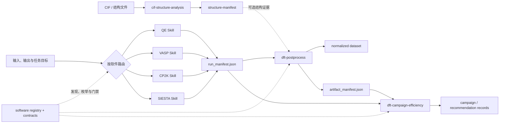

# DFT Codex Skills

<p align="center">
  <strong>Traceable calculation, structure analysis, postprocessing, and campaign learning for DFT workflows</strong><br>
  <strong>面向 DFT 工作流的可追溯计算、结构分析、后处理与计算经验学习</strong>
</p>

<p align="center">
  <a href="#中文">中文</a> · <a href="#english">English</a>
</p>

> **最后更新 / Last updated:** 2026-07-18 (Asia/Shanghai)
>
> **当前组成 / Current scope:** 7 Codex Skills · 4 DFT engines · 8 shared JSON contracts

This private repository is the single source of truth for the installed DFT Codex Skills. It keeps official software evidence, deterministic gates, shared contracts, synthetic fixtures, and maintainable Python tooling together without committing private calculation trees, licensed potentials, credentials, or unpublished results.

本私有仓库是本机 DFT Codex Skills 的唯一源码真源。仓库统一维护官方资料证据、确定性门禁、共享契约、合成测试夹具和可维护的 Python 工具，但不提交私人计算目录、受许可限制的势文件、凭据或未发表结果。

## 展示 / Showcase

<table>
  <tr>
    <td width="42%" align="center">
      <br>
      <sub>CIF 静态 c 轴投影 / static c-axis projection</sub>
    </td>
    <td width="58%" align="center">
      <br>
      <sub>能带–TDOS/PDOS 联合图 / combined bands–TDOS/PDOS plot</sub>
    </td>
  </tr>
</table>

> 展示图由仓库内的 CIF 分析器和 DFT 后处理代码从合成夹具生成，只用于功能演示，不是参考结构或科研结果。运行 `python3 docs/showcase/generate_showcase.py` 可重新生成。
>
> These figures are generated by the repository's CIF analyzer and DFT postprocessing code from synthetic fixtures. They demonstrate functionality only and are not reference structures or scientific results. Regenerate them with `python3 docs/showcase/generate_showcase.py`.

---

## 中文

### 全库组成

| 层级 | Skill | 核心职责 | 主要交付物与边界 |
|---|---|---|---|
| 结构入口 | `cif-structure-analysis` | 严格解析 CIF1/CIF2 数据块与原始标签；保留标准不确定度；检查占位、短距离、周期近邻和配位；进行元素对/目标键长匹配、对称性尝试、结构身份和静态投影 | 输出 `structure-manifest` JSON、Markdown 与可选 PNG；只陈述代码支持的结构事实，不判断热力学/动力学稳定性 |
| 计算 | `qe-rigorous-calculations` | Quantum ESPRESSO 输入设计、官方参数证据、输入/输出审计、重启谱系、数值收敛和 QE 工作流 | 以 fail-closed 门禁形成 `run_manifest.json`；官方默认值不等于科学充分 |
| 计算 | `vasp-rigorous-calculations` | VASP 的 INCAR/POSCAR/KPOINTS/POTCAR 元数据、运行完成性、任务证据、收敛和高级方法路由 | 不提交 POTCAR 内容；技术通过不自动等于物理结论成立 |
| 计算 | `cp2k-rigorous-calculations` | CP2K Quickstep、GPW/GAPW、基组/赝势来源、输入输出门禁、版本匹配手册和可观测量证据 | 对未覆盖语法或高级方法显式阻断或转专家审查 |
| 计算 | `siesta-rigorous-calculations` | SIESTA FDF、PSF/PSML/VPS 元数据、输入输出身份、父任务/重启谱系、收敛与任务支持边界 | 未自动化的官方功能仍保持未评估，不以“软件支持”替代本库验证 |
| 后处理 | `dft-postprocess` | 盘点、抽取、归一化、验证、分析和绘图；管理工具探测、数据集、图元数据与 artifact manifest | QE/VASP 原生路径较成熟；CP2K/SIESTA 路由仍按可观测量和真实夹具成熟度显式分级 |
| 经验与效率 | `dft-campaign-efficiency` | 把隐私安全的运行/活动证据归一化为 campaign record；比较 wall time、core-hours、存储、重跑和关键路径 | 输出带证据等级的建议；只提供建议，绝不静默修改输入或降低科学验收标准 |

共享层包括：

- `registry/software-registry.yaml`：计算软件、对应计算 Skill、能力目录和服务接口的唯一注册入口。
- `contracts/`：`structure`、`run`、`postprocess plan`、`tool execution`、`normalized dataset`、`artifact`、`campaign` 和 `recommendation` 八类版本化 JSON Schema。
- `tools/`：全库测试、Skill 校验、注册表/Schema 同步审计、安全安装和仓库卫生检查。
- `docs/`：总体联动与扩展规划、日期化审计报告和可复现展示资产。

### 调用逻辑



选择规则：

1. 只问 CIF 成分、晶胞、坐标、近邻、配位、键长匹配、对称性或投影时，调用 `cif-structure-analysis`。
2. 涉及计算输入、运行完成性、重启、参数依据或收敛时，按软件调用 QE、VASP、CP2K 或 SIESTA 计算 Skill；计算 Skill 对技术正确性与科学证据负责。
3. 涉及抽取、归一化、能带、DOS/PDOS、声子、EPC、实空间场、NEB、光学、图表或 artifact 时，调用 `dft-postprocess`；先检查具体 `code × observable × backend` 的成熟度。
4. 涉及成本、并行配置、重跑原因、关键路径或跨任务经验时，调用 `dft-campaign-efficiency`；建议不得跨过计算和后处理验收门禁。
5. 复合任务按“结构事实 → 计算审计 → 后处理 → 经验沉淀”联动。当前交接优先使用共享 manifest，但部分跨 Skill 来源哈希和语义一致性仍是后续强化项，因此不能仅凭文件名推定证据链完整。

### 使用方法

#### 1. 安装

从仓库根目录先预览，再把七个 Skill 以符号链接安装到 Codex Skill 目录：

```bash
python3 tools/install_skills.py --dry-run
python3 tools/install_skills.py
```

安装器不会覆盖已有真实目录。若目标位置已有旧副本，应先比较并备份，再显式迁移；符号链接安装后，本地检出分支就是本机 Skill 的实际源码版本。

#### 2. 在 Codex 中调用

可以直接描述任务，让 Codex 根据 Skill 描述路由；需要强制指定时可显式点名：

```text
使用 $cif-structure-analysis 检查 sample.cif，并寻找 2.41 ± 0.05 Å 的 Mo-S 近邻键。
使用 $qe-rigorous-calculations 审计这个 ph.x 任务的输入、父任务和输出完成性。
使用 $dft-postprocess 从已审计的运行结果生成带 provenance 的能带和 PDOS 图。
使用 $dft-campaign-efficiency 比较两组并行配置，但保持现有收敛与物理验收标准不变。
```

#### 3. 直接运行确定性工具

分析 CIF 并输出结构 manifest、Markdown、三轴投影和目标键长匹配：

```bash
python3 skills/cif-structure-analysis/scripts/analyze_cif.py \
  --input sample.cif \
  --json structure-manifest.json \
  --markdown structure-analysis.md \
  --views-dir structure-views \
  --match-elements Mo-S \
  --match-bond-length 2.41 \
  --match-bond-tolerance 0.05
```

验证共享 manifest 或生成后处理能力快照：

```bash
python3 skills/dft-postprocess/scripts/dftpost_cli.py \
  validate-manifest structure structure-manifest.json

python3 skills/dft-postprocess/scripts/dftpost_cli.py \
  capabilities --out capabilities.json
```

具体计算 Skill 的命令、前置证据和任务矩阵请从对应 `SKILL.md` 开始，并按其 `references/` 路由；不要把一个软件的参数和经验默认推广到另一个软件。

#### 4. 开发与验收 / Development and acceptance

```bash
python3 tools/run_tests.py
python3 tools/validate_all_skills.py
python3 tools/audit_repository.py
git diff --check -- . ':(exclude)skills/qe-rigorous-calculations/references/official-*'
```

新增软件时必须先登记 `registry/software-registry.yaml`；新增后处理能力时必须为 `observable × code × backend` 作显式实现或 `design-only` 决定，并同步契约、测试和文档。运行数据库、原始计算树、绝对私人路径、主机/账号、受限势文件和秘密信息不得进入 Git。

### 后续更新方向

- 建立共享 semantic/privacy validator，并把 `run → postprocess plan → artifact` 的来源 SHA-256、软件版本、任务和结构身份强绑定。
- 将后处理中央分支继续拆成 adapter 注册与标准 test hooks，降低新增软件或新可观测量的漏改风险。
- 为 CP2K、SIESTA 的更多后处理路线补齐真实产物前向测试；在同样的门禁下接入 ABINIT、CASTEP、GPAW 等后续软件。
- 扩展 CIF 的质量/无序度、配位多面体、拓扑、层状与真空、结构比较、变换/export、倒空间、衍射、数据库与批处理适配器。
- 扩展缺陷、表面、磁性、SOC、混合泛函、GW、输运和高通量活动的任务能力与可观测量契约。
- 增加契约迁移工具、版本升级降级策略，以及跨活动验证后再提升可信度的效率知识生命周期。

---

## English

### Repository composition

| Layer | Skill | Primary responsibility | Main output and boundary |
|---|---|---|---|
| Structure entry | `cif-structure-analysis` | Strict CIF1/CIF2 block and raw-tag parsing; uncertainties, occupancy, periodic neighbors, coordination, target bond matching, symmetry evidence, identity, and static projections | Emits a versioned structure manifest, Markdown, and optional PNGs; reports code-backed structure facts but does not assert physical stability |
| Calculation | `qe-rigorous-calculations` | Quantum ESPRESSO workflow design, official parameter evidence, input/output audit, restart ancestry, and numerical convergence | Emits fail-closed run evidence and `run_manifest.json`; documented defaults are not automatically scientifically sufficient |
| Calculation | `vasp-rigorous-calculations` | INCAR/POSCAR/KPOINTS/POTCAR metadata, completion, task evidence, convergence, and advanced-method routing | Never stores licensed POTCAR content; technical passage alone does not establish a physical claim |
| Calculation | `cp2k-rigorous-calculations` | CP2K Quickstep, GPW/GAPW, basis/pseudopotential provenance, version-matched manuals, deterministic gates, and observable evidence | Unsupported syntax or methods remain blocked or require explicit expert review |
| Calculation | `siesta-rigorous-calculations` | SIESTA FDF and pseudopotential metadata, input/output identity, parent/restart lineage, convergence, and task boundaries | Official-but-unautomated behavior stays unassessed until this repository validates it |
| Postprocessing | `dft-postprocess` | Inventory, extraction, normalization, validation, analysis, plotting, tool probing, datasets, plot metadata, and artifact manifests | Native QE/VASP routes are stronger; CP2K/SIESTA remain explicitly gated per observable and real-fixture maturity |
| Experience and efficiency | `dft-campaign-efficiency` | Normalize privacy-safe evidence into campaign records and compare wall time, core-hours, storage, reruns, and critical paths | Produces evidence-ranked advice only; it never silently edits inputs or weakens scientific acceptance |

The shared layer contains the canonical software registry, eight versioned JSON contracts, repository-wide validation and installation tools, integration plans, audit reports, and reproducible showcase assets.

### Invocation logic

Use the structure Skill for CIF-backed facts; use the matching calculation Skill for inputs, completion, restarts, parameter provenance, and convergence; use postprocessing for extraction, normalization, observables, figures, and artifact provenance; and use campaign efficiency for cost and workflow learning after scientific gates are preserved. Composite requests follow the same structure → calculation → postprocess → learning sequence shown in the diagram above.

Ownership remains explicit: calculation Skills own calculation integrity, postprocessing owns derived-data and figure validity, and the efficiency Skill is advisory. Shared manifests are the preferred handoff, but not every cross-Skill source hash and semantic relation is enforced yet; a matching filename is therefore not sufficient evidence of lineage.

### Usage

Preview and install repository-backed symlinks:

```bash
python3 tools/install_skills.py --dry-run
python3 tools/install_skills.py
```

Codex can select a Skill from a natural-language request, or you can name one explicitly:

```text
Use $cif-structure-analysis to inspect sample.cif and match Mo-S neighbors at 2.41 ± 0.05 Å.
Use $vasp-rigorous-calculations to audit this relaxation and its static parent.
Use $dft-postprocess to create provenance-bearing bands and PDOS figures from accepted evidence.
Use $dft-campaign-efficiency to compare two parallel layouts without changing acceptance criteria.
```

For deterministic CLI use, start with each Skill's `SKILL.md` and its routed `references/`. The CIF and shared validation examples in the Chinese section are directly executable from the repository root. Before publishing any change, run the four validation commands shown under “开发与验收 / Development and acceptance”.

### Planned evolution

- Enforce shared semantic/privacy validation and SHA-256-bound `run → plan → artifact` lineage, including code, version, task, and structure identity.
- Move remaining postprocessing central branches to adapter registration and standard test hooks.
- Add real-artifact forward tests for more CP2K/SIESTA observables and onboard future engines through the same registry-first gates.
- Extend CIF support through quality/disorder, coordination polyhedra, topology, layers/vacuum, comparison, transformations/exports, reciprocal space, diffraction, database, and batch adapters.
- Add calculation capabilities for defects, surfaces, magnetism, SOC, hybrids, GW, transport, and high-throughput campaigns without conflating software support with validated scientific evidence.
- Add contract migrations, version-aware recommendation downgrade rules, and a stronger lifecycle for cross-campaign efficiency knowledge.

## Data and licensing boundary

This repository intentionally excludes runtime experience databases, raw calculation outputs, licensed potential contents, credentials, private hosts/accounts, and unpublished numerical results. Synthetic fixtures and derived official-document snapshots remain subject to their recorded provenance and source terms.
