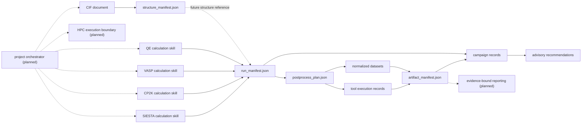

# DFT Skill 联动与扩展规划

## 目标架构

仓库保持四类边界独立：结构事实、计算正确性、后处理正确性、跨任务效率经验。任何下游记录都只能消费上游证据，不能反向改变上游科学判据。



当前已经实现的实线语义不完全等价于强制校验：CIF Skill 已生成严格的 structure manifest，计算 Skill 可生成 run manifest，后处理可生成 plan/dataset/execution/artifact，效率 Skill 可从 run manifest 转换记录；但 structure manifest 尚未绑定到各计算 run，run manifest 到 plan/artifact 的来源绑定也尚未强制校验。

虚线层已经作为架构占位登记，但未实现、未安装、未路由。未来的编排层只管理状态、证据交接和批准边界；HPC 层只管理调度器/远端副作用；报告层只消费已验证 artifact。三者都不能绕过计算、后处理或科学验收门禁。

## 稳定接口

### 1. 新计算软件入口

以 [`registry/software-registry.yaml`](../registry/software-registry.yaml) 为唯一软件注册入口，以 [`registry/skill-registry.yaml`](../registry/skill-registry.yaml) 为唯一 Skill 生命周期和路由入口。软件先以不可调用的 `planned` 占位登记；Skill 有源码但尚未完成验收时使用 `development` 并保存在 `skills/`，仍不可安装、不可路由；只有显式晋级后才成为 `active`。每个活动计算软件必须声明：

- 稳定的小写 `code`；
- 计算 Skill 目录；
- 代码本地 capability catalog；
- 生命周期；
- run manifest、postprocess 和 campaign efficiency 三个接口状态。

注册表只负责身份、归属和接口发现，不证明任何解析器或科学流程已经成熟。新增软件后依次执行：

1. 在 `planned_software` 登记身份、角色、范围、预定集成方式、预定 Skill 和激活 profile；仅保留身份时，Skill 注册表使用 `planned` 与 `path: null`；创建源码后改为 `development` 与 `skills/<name>`，但仍不得路由或安装。
2. `planned` 身份阶段不得创建 `skills/<name>/` 空壳；进入真实实现后使用 `development` 源码目录，但仍不得加入安装器、活动 Agent 路由、共享契约软件枚举或 observable 覆盖。
3. 准备版本匹配的第一手来源、输入/输出/重启/完成性门禁、任务证据 profile、合法夹具、provenance 和科学限制。
4. development 源码满足激活条件后，在同一 `skills/<name>/` 路径显式晋级注册表，并运行 `python3 tools/sync_contract_codes.py --write` 后审查严格 Schema 枚举改动。
5. 对每个 postprocess observable 作显式路由决策；尚未成熟的已激活计算软件使用 `design-only`，不能省略后由程序猜测。
6. 运行全库审计和回归测试；只有对应层级证据完成后，才逐级提升输入/运行/后处理成熟度。“软件可执行”或“工具已安装”不提升成熟度。

`planned` 注册允许路线图在不改变运行行为的情况下提前进入版本控制；`development` 允许源码接受维护审查但保持不可调用；`active` 晋级要求联动变更完整，否则审计失败。三种生命周期不可混用。

当前拟规划软件分为：

- 计算/模拟引擎：Gaussian、GROMACS、LAMMPS；
- 机器学习势与原子模拟：DeePMD-kit、MACE、NequIP、GPUMD、LASP、GemNet-OC、EquiformerV2、FairChem UMA；
- 后处理与科学工作流：Multiwfn、Phonopy、VASPKIT、CatMAP、LOBSTER；
- 结构与可视化适配：pymatgen、RDKit、OVITO。

Phonopy、VASPKIT 和 pymatgen 对应源码已经进入 `development`，但现有局部 adapter/probe 仍受当前后处理成熟度约束；目录存在不会被解释为独立 Skill 已完成或软件已激活。

### 2. 新计算功能入口

新的计算功能先进入对应软件的 capability catalog，而不是直接塞入通用 CLI。VASP、CP2K、SIESTA 当前使用 `references/task-evidence-profiles.json`；QE 暂时由 `references/fail-closed-contract.md` 承载，后续应迁移为同类机器可读 profile。

每个新功能至少需要以下字段或等价证据：

- 稳定 `task_type` 和支持范围；
- 必需输入、父任务/重启谱系和输出证据角色；
- 技术完成条件和阻断标记；
- 可自动抽取的 observable；
- 数值收敛维度、物理/模型检查和不可自动化边界；
- 正例、负例、版本边界和成熟度。

如果新功能产生新的可分析物理量，再按下一节扩展后处理；计算 capability 和 postprocess observable 是两个独立门禁，不能因为其中一侧已实现就声称端到端完成。

### 3. 新后处理 observable 或 backend 入口

以 `skills/dft-postprocess/references/observable-registry.yaml` 为唯一 observable/backend 路由入口：

1. 定义 observable id、规范化 dataset 类型、校验、分析和绘图输出。
2. 为每个已注册计算代码给出显式 route 和成熟度。
3. backend 声明实现状态、类型和 capability key；可执行文件存在只表示 available。
4. 实现 adapter、参数/证据校验、原子写入和拒绝覆盖行为。
5. 先用 synthetic fixture 验证数学和契约，再用 format fixture 验证格式，最后用可合法使用的 real artifact 做前向测试。
6. publication figure 必须来自已验证的 normalized dataset，并保留能量零点、单位、归一化、选择器和限制。

中期应把 `planning.py` 的 backend 命令构造从长条件链拆成 adapter registry；每个 adapter 暴露统一的 `plan/execute/normalize/validate` 接口，使新增 backend 不再修改中央分支逻辑。

### 4. 共享契约与版本

`contracts/` 继续使用 `additionalProperties: false`。严格 Schema 是科学门禁，不应为了方便扩展而允许任意字段。扩展规则为：

- 新软件代码：更新注册表，再由同步工具更新现有 `1.0` 代码枚举；
- 新的可选、非门禁元数据：可以发布向后兼容的 `1.x`，并补默认/迁移测试；
- 改变必需字段、状态语义、哈希绑定或接受条件：发布 `2.0`，提供迁移器和双版本读取期；
- extension 字段不得覆盖 `status`、`scientific_acceptance`、maturity、hash、evidence 或 validation gate。

下一版契约应优先增加：

- run manifest 的跨字段语义校验和隐私校验；
- artifact 对 source run manifest 的路径外标签、记录 ID 和 SHA-256 绑定；
- plan 对 source run 的 code/version/task/acceptance 一致性检查；
- dataset、execution、artifact 的链式 ID/hash 关系；
- run manifest 对 structure manifest ID、源 CIF 哈希、结构指纹和所用变换末端的引用。

### 5. CIF 结构与新结构功能入口

`contracts/structure-manifest.schema.json` 是 CIF/结构事实的共享入口。当前 producer 保留 CIF1/CIF2 data block、原始数值与不确定度、占位/无序警告、ASE 代表结构、周期镜像近邻、spglib 证据、隐私安全 provenance 和有边界的有序结构指纹。

新增结构功能时遵循 `skills/cif-structure-analysis/references/extension-interfaces.md`：局部 adapter 返回 payload 与稳定诊断，不在中央 CLI 堆软件条件链；结构发生变化时必须生成新指纹并追加 transformation/backend/parameters/parent fingerprint/site mapping。未来 QE/VASP/CP2K/SIESTA exporter 只负责结构文件与谱系，计算参数仍由对应计算 Skill 决策。

### 6. 跨软件能力与长期接口

已采纳的后续架构保留五类跨软件 Skill，占位信息统一存入 Skill 注册表：

1. `dft-project-orchestrator`：把结构、计算、后处理与经验记录组织成可暂停、可恢复的状态机；它只协调，不接管领域门禁。
2. `dft-hpc-execution`：隔离本地/远端执行、调度器、凭据、重试、取消和审计副作用；需要明确的人工批准边界。
3. `dft-reporting`：从 artifact/campaign 生成有 claim-to-evidence 绑定的双语报告，不从原始文件绕过验证层。
4. `literature-to-dft-plan`：把第一手文档和文献证据转为带来源等级、版本与假设标记的计算计划。
5. `dft-review-response`：把审稿问题映射到主张、计算证据、图表和仍不足的证据，不自动夸大结论。

此外，`dft-structure-preparation` 预留 pymatgen/RDKit 结构准备边界；ML potential 方向必须把数据集、模型、元素范围、单位、训练/验证切分、软件版本和外推限制视为一级 provenance，而不是把模型文件当作普通势文件。

每个未来 Skill 都使用版本化 `consumes`/`produces` 接口。尚无 Schema 的未来接口只是架构名称，不是已实现契约；创建 Schema 时仍需按共享契约的兼容性规则评审。

## 分阶段实施

### M0：安全占位与路由边界（已完成）

- 软件注册表分离活动计算软件与拟规划软件，拟规划条目绑定可审计的 activation profile。
- Skill 注册表集中记录 `active`、`development`、`planned` 生命周期、路径、接口角色与副作用类别。
- 仓库审计验证：`planned` Skill 没有源码目录；`development` Skill 有源码但不进入活动 Skill 集、安装、共享软件枚举或 observable 覆盖；每个拟规划软件都有明确归属。
- 回归测试覆盖三态 lifecycle、未知 activation profile、development 意外可路由路径和活动枚举污染。

验收：登记未来软件不会改变当前 4 个活动代码、7 个活动 Skill 或现有运行契约；误把占位写成可路由项时验证失败。

### P0：交接真实性

- 新建共享 semantic validator，阻止 `status=accepted` 与 `scientific_acceptance=not_assessed` 等矛盾组合。
- terminal/accepted run 要求符合角色要求的 evidence；`create_run_manifest.py` 已支持导入证据记录，下一步由语义校验器按任务 profile 强制角色完整性。
- plan 必须接收 run manifest；artifact 必须记录 source run manifest SHA-256，并验证 code 和 source ID。
- 把隐私检查提升到所有共享契约入口，明确 runtime-only execution record 的存放边界。
- 迁移已安装 Skill 为仓库符号链接；迁移前逐目录比较，禁止自动覆盖真实目录。

验收：构造矛盾状态、伪造 source ID、修改上游 manifest、写入私有绝对路径时，统一验证器均 fail closed。

### P1：扩展成本与成熟度

- 把后处理 planner、capability detector 和 backend implementation 注册统一到 adapter registry。
- 为 CP2K、SIESTA 增加合法、版本明确的 real-artifact 前向测试，再按 observable 单独晋级。
- 把 QE capability catalog 迁移为机器可读 task profile，并建立跨代码的 task alias 映射。
- 给每个 Skill 提供标准离线测试入口，使 `tools/run_tests.py` 不再维护代码专属命令列表。
- 把已实现的 CIF structure manifest 接入 run manifest；为标准化、超胞、表面和格式导出增加实际 transformation producer 与 round-trip 测试。
- 定义 orchestrator 的最小状态机与跨 Skill 场景夹具，但不在科学交接契约完成前启用自动执行。

验收：增加一个实验性计算软件或一个新 observable 时，只需注册、实现局部 adapter/profile 和测试；遗漏的共享决策由仓库审计精确列出。

### P2：长期维护与效率闭环

- 建立 contract migration 工具和兼容性测试矩阵。
- campaign records 同时绑定 run/artifact 证据哈希，区分技术完成、artifact 完成和科学接受。
- 只从重复、可比、已接受记录晋级效率建议，并记录适用代码版本、任务、系统类别和协议。
- 为远端 CI 增加 registry drift、隐私样例、安装预演和 fixture provenance 检查。
- 定义 HPC 执行/批准边界、证据绑定报告和文献/审稿证据工作流；用端到端正例、负例和中断恢复场景验收联动，而不只验证单个 CLI。

验收：历史记录可迁移、建议可追溯、版本变化可使旧建议自动降级为待复核，不发生静默参数改写。

## 维护命令

```bash
python3 tools/software_registry.py
python3 tools/skill_registry.py
python3 tools/sync_contract_codes.py
python3 tools/audit_repository.py
python3 tools/audit_repository.py --check-installed
python3 tools/run_tests.py
python3 tools/validate_all_skills.py
```

`--check-installed` 是部署审计，不纳入普通离线测试；开发机可以有未迁移的真实目录，但在声明安装一致前必须处理完这些失败项。
